# Lobisomens da Torre Sangrenta

## Sumário

- [Base](#base)
  - [Contexto](#contexto)
  - [Decorrer do dia](#decorrer-do-dia)
  - [Tribunal](#tribunal)
  - [Noite](#noite)
  - [Fantasmas](#fantasmas)
  - [Objetivos de vitória](#objetivos-de-vitoria)
- [Lista rápida de personagens](#lista-rapida-de-personagens)
- [Personagens](#personagens)
  - [Essenciais](#essenciais)
  - [Aldeões](#aldeoes)
  - [Personagens malvados](#personagens-malvados)
  - [Personagens independentes](#personagens-independentes)
  - [Personagens flexíveis](#personagens-flexiveis)
  - [Personagens complexos](#personagens-complexos)
  - [Personagens forretas (para quando há muita gente)](#personagens-forretas-para-quando-ha-muita-gente)
  - [Extras](#extras)
- [A Noite](#a-noite)
  - [Primeira Noite](#primeira-noite)
  - [Início da Segunda Noite](#inicio-da-segunda-noite)
  - [Noite Normal](#noite-normal)
- [Código para o guião interativo](#codigo-para-o-guiao-interativo)

---

## Base

### Contexto
A aldeia tem um problema com Criaturas Malvadas: os Lobisomens e os seus Aliados! Os Lobisomens matando todas as noites, os Aldeões têm que executar essas Criaturas Malvadas. Mas como é que os Aldeões vão escolher quem executar?

### Decorrer do dia
Durante o dia (5 minutos), os jogadores andam livremente pelos diferentes lugares na aldeia (a sala ou o edifício), mas como estão todos a suspeitar uns dos outros, podem dizer qualquer coisa (incluindo revelar ou mentir sobre o seu papel e o que sabe sobre os outros), o objetivo é convencer os outros, criar alianças, planejar assassinatos, etc. No fim do dia (3 minutos) toda a aldeia se encontra no tribunal (centro da sala) para decidir quem irão executar. É importante que todos os jogadores guardem sempre os mesmos lugares!

### Tribunal
No tribunal, nenhuma informação específica pode ser divulgada por um jogador que não esteja num processo (podem simplesmente dizer se estão a suspeitar de alguém, não o porquê). Um jogador pode nomear um outro para um interrogatório.

1. O jogador que nomeia se posiciona no lugar de Prosecutor, o nomeado se posiciona no lugar do Acusado.
2. O Prosecutor pode então explicar a sua acusação.
3. Em seguida, o Acusado pode se defender.
4. Finalmente, a aldeia pode questionar o Acusado.
5. Uma vez o questionário terminado, a aldeia vota se querem executar o acusado.
6. No mínimo metade da aldeia tem que votar SIM para o acusado ser executado.

> [!IMPORTANT]
> PODE HAVER VÁRIAS NOMEAÇÕES POR DIA.

### Noite
Após o tribunal, toda a aldeia vai dormir (fechar os olhos no tribunal). É importante que os jogadores guardem sempre os mesmos lugares! Durante a noite, o Narrador guia toda a aldeia a cumprir as suas funções de personagem.

### Fantasmas
Há dois tipos de morte: EXECUÇÃO (condenados pela aldeia) ou ASSASSINATO (mortos pelo poder de um personagem).

Quando um jogador é morto durante a noite, só morre mesmo de manhã, ao acordar, assim durante aquela noite podem continuar a usar os seus poderes.

Os jogadores mortos transformam-se em fantasmas, que podem continuar a comunicar com a aldeia durante o dia, mas não podem falar ou votar no tribunal, e perdem qualquer poder que tinham (a não ser que esteja escrito o contrário na ficha de personagem.) Fantasmas guardam o mesmo objetivo que enquanto vivos. Os Fantasmas TAMBÉM DORMEM À NOITE.

### Objetivos de vitória
- **Aldeões:** Matar todos os Lobisomens
- **Criaturas Malvadas:** Matar todos os Aldeões
- **Namorados e Cupido:** Os Namorados serem os únicos sobreviventes
- **Amante Secreto:** Ser o único sobrevivente com um dos Namorados
- **Lobisomem branco:** Ser o único sobrevivente

---

## Lista rápida de personagens
Usa esta lista como mapa de navegação para saltar diretamente para uma ficha na tabela.

### Essenciais

| Código | Personagem | Ficha |
|---|---|---|
| `e01` | Lobisomem | [ver ficha](#e01) |
| `e02` | Bruxa Malvada | [ver ficha](#e02) |
| `e03` | Chaman | [ver ficha](#e03) |
| `e04` | Vidente | [ver ficha](#e04) |

### Aldeões

| Código | Personagem | Ficha |
|---|---|---|
| `v01` | Menina | [ver ficha](#v01) |
| `v02` | Domador do Urso | [ver ficha](#v02) |
| `v03` | Domador do Corvo | [ver ficha](#v03) |
| `v04` | Domador da Raposa | [ver ficha](#v04) |
| `v05` | Domador dos Coelhos | [ver ficha](#v05) |
| `v06` | Marionetista | [ver ficha](#v06) |
| `v07` | Cavaleiro Enferrujado | [ver ficha](#v07) |
| `v08` | Caçador | [ver ficha](#v08) |
| `v08b` | Capuchinho Vermelho | [ver ficha](#v08b) |
| `v09` | Capitão | [ver ficha](#v09) |
| `v10` | Paranoico | [ver ficha](#v10) |
| `v11` | Chefe da Aldeia | [ver ficha](#v11) |
| `v12` | Cigana | [ver ficha](#v12) |
| `v13` | Juiz | [ver ficha](#v13) |
| `v14` | Acusador | [ver ficha](#v14) |
| `v15` | Piromaníaco | [ver ficha](#v15) |
| `v16` | Sonâmbulo | [ver ficha](#v16) |
| `v17` | Salvador | [ver ficha](#v17) |
| `v18` | Anjo | [ver ficha](#v18) |
| `v19` | Profeta | [ver ficha](#v19) |
| `v20` | Empregada | [ver ficha](#v20) |
| `v21` | Faroleiro | [ver ficha](#v21) |
| `v22` | Pedro | [ver ficha](#v22) |
| `v23` | Domador da Aranha | [ver ficha](#v23) |

### Personagens malvados

| Código | Personagem | Ficha |
|---|---|---|
| `m01` | Lobisomem Mau | [ver ficha](#m01) |
| `m02` | Lobisomem Vidente | [ver ficha](#m02) |
| `m03` | Lobisomem Vampiro | [ver ficha](#m03) |
| `m04` | Ankou | [ver ficha](#m04) |
| `m05` | Cupido Malvado | [ver ficha](#m05) |

### Personagens independentes

| Código | Personagem | Ficha |
|---|---|---|
| `s01` | Cupido | [ver ficha](#s01) |
| `s02` | Lobisomem Branco | [ver ficha](#s02) |

### Personagens flexíveis

| Código | Personagem | Ficha |
|---|---|---|
| `f01` | Ladrão | [ver ficha](#f01) |
| `f02` | Espião | [ver ficha](#f02) |

### Personagens complexos

| Código | Personagem | Ficha |
|---|---|---|
| `a01` | Bêbado | [ver ficha](#a01) |
| `a02` | Cão-Lobo | [ver ficha](#a02) |
| `a03` | Mimo | [ver ficha](#a03) |
| `a04` | Ator | [ver ficha](#a04) |
| `a05` | Rouba-Túmulos | [ver ficha](#a05) |
| `a06` | Ilusionista | [ver ficha](#a06) |
| `as01b` | Amante Secreto | [ver ficha](#as01b) |

### Personagens forretas (para quando há muita gente)

| Código | Personagem | Ficha |
|---|---|---|
| `l01` | Aldeão Triste | [ver ficha](#l01) |
| `l02` | Criança Selvagem | [ver ficha](#l02) |
| `l03` | Irmãs | [ver ficha](#l03) |
| `l04` | Irmãos | [ver ficha](#l04) |

### Extras

| Código | Personagem | Ficha |
|---|---|---|
| `x01` | Aldeões | [ver ficha](#x01) |
| `x02` | Criaturas Malvadas | [ver ficha](#x02) |
| `x02.1` | Lobisomens | [ver ficha](#x02.1) |
| `x03` | Fantasma | [ver ficha](#x03) |
| `x.v09` | Soldado | [ver ficha](#x.v09) |
| `x.s01` | Namorado | [ver ficha](#x.s01) |
| `x.as01b.1` | Traidor | [ver ficha](#x.as01b.1) |
| `x.as01b.2` | Traído | [ver ficha](#x.as01b.2) |
| `x.m05` | Inimigo | [ver ficha](#x.m05) |

---

## Personagens

### Essenciais

<table class="character-table">
<colgroup>
<col class="image-col" width="150">
<col>
</colgroup>
<thead>
<tr>
<th width="150">Carta</th>
<th>Descrição</th>
</tr>
</thead>
<tbody>
<tr class="role-row faction-evil" id="e01">
<td class="role-image-cell" width="150" valign="top" align="center">
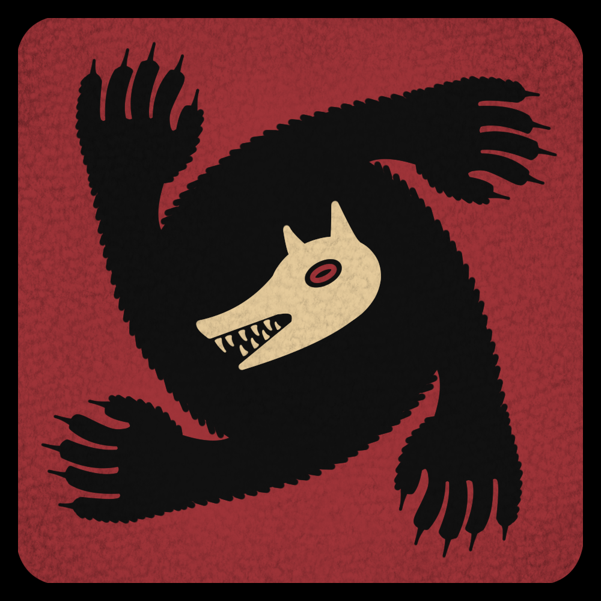

<code>e01</code>

</td>
<td class="role-text-cell" valign="top">

🟥 <code>e01</code> · Lobisomem Criaturas Malvadas

Categoria: Essenciais · <a href="#lista-rapida-de-personagens">voltar à lista rápida</a>

Cada noite, escolhe com os outros Lobisomens quem vão assassinar.

<strong>Se qualquer Lobisomem estiver envenenado:</strong> Não podem matar.

<strong>Objetivo:</strong> Matar todos os Aldeões.

</td>
</tr>
<tr class="role-row faction-evil" id="e02">
<td class="role-image-cell" width="150" valign="top" align="center">
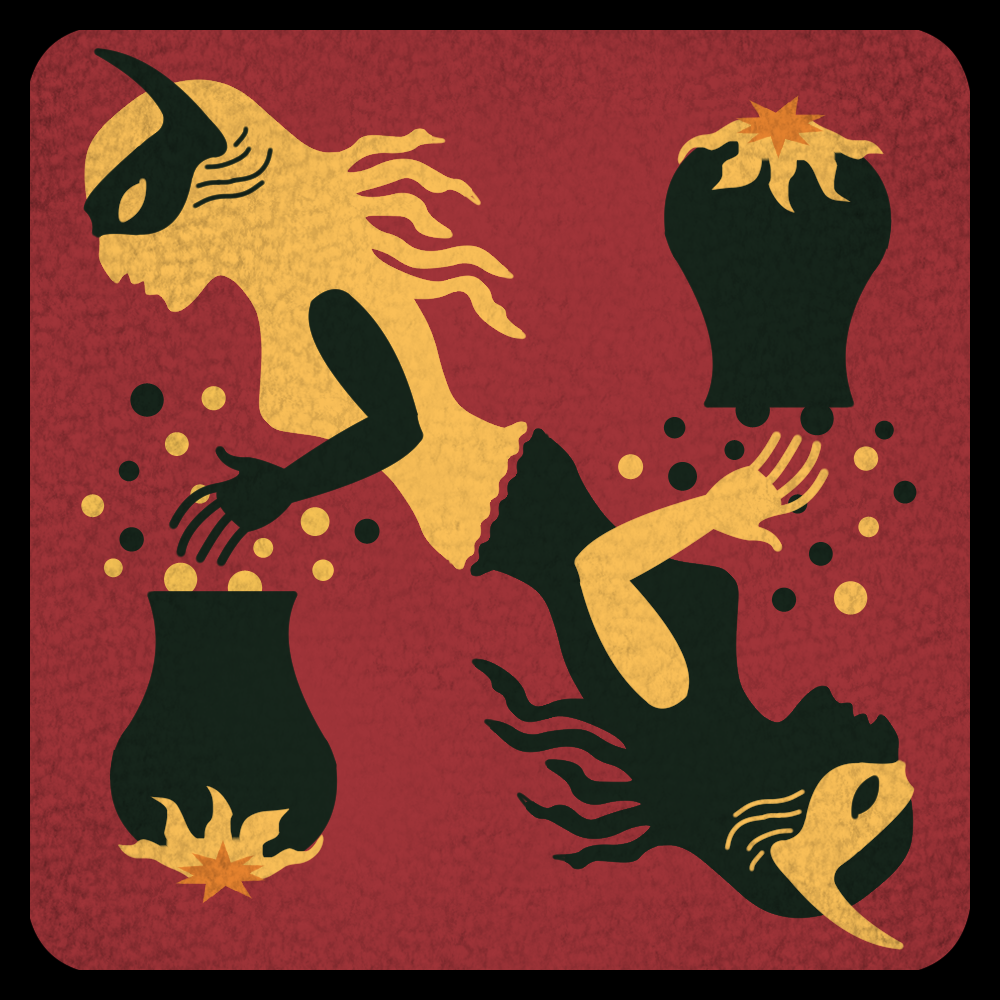

<code>e02</code>

</td>
<td class="role-text-cell" valign="top">

🟥 <code>e02</code> · Bruxa Malvada Criaturas Malvadas

Categoria: Essenciais · <a href="#lista-rapida-de-personagens">voltar à lista rápida</a>

NÃO ACORDA COM OS LOBISOMENS.

Cada noite, a Bruxa pode envenenar um jogador.

O jogador afetado terá problemas ao usar os seus poderes (receberá informações erradas).

<strong>Se envenenada:</strong> É imune a todos os ataques.

<strong>Objetivo:</strong> Matar todos os Aldeões.

</td>
</tr>
<tr class="role-row faction-good" id="e03">
<td class="role-image-cell" width="150" valign="top" align="center">
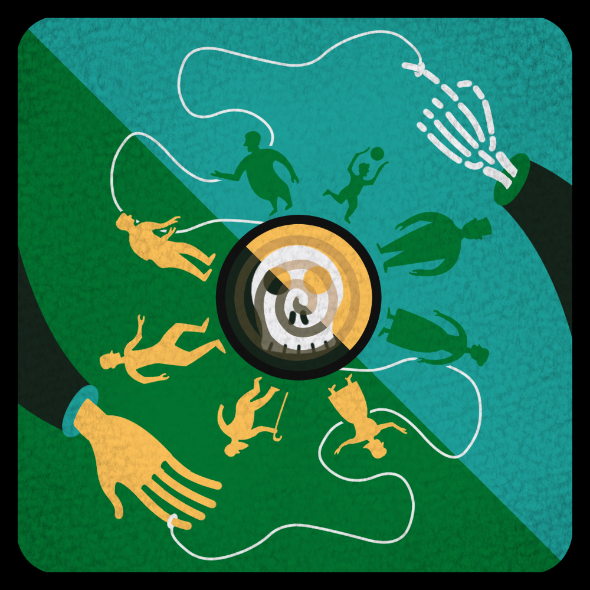

<code>e03</code>

</td>
<td class="role-text-cell" valign="top">

🟩 <code>e03</code> · Chaman Aldeões

Categoria: Essenciais · <a href="#lista-rapida-de-personagens">voltar à lista rápida</a>

Cada noite é avisado sobre os jogadores assassinados e pode escolher salvá-los.

O Chaman pode salvar (👍) dois jogadores durante todo o jogo.

<strong>Se envenenado:</strong> Não salva o jogador.

<strong>Objetivo:</strong> Matar todos os Lobisomens.

</td>
</tr>
<tr class="role-row faction-good" id="e04">
<td class="role-image-cell" width="150" valign="top" align="center">
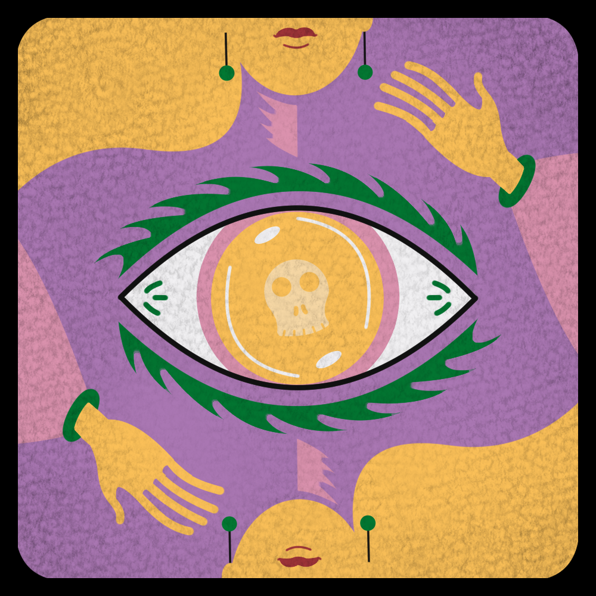

<code>e04</code>

</td>
<td class="role-text-cell" valign="top">

🟩 <code>e04</code> · Vidente Aldeões

Categoria: Essenciais · <a href="#lista-rapida-de-personagens">voltar à lista rápida</a>

Cada vez que um jogador é morto, a Vidente descobre qual era o seu poder (será informada na próxima noite).

<strong>Se envenenada:</strong> Não receberá a informação correta.

<strong>Objetivo:</strong> Matar todos os Lobisomens.

</td>
</tr>
</tbody>
</table>
---

### Aldeões

<table class="character-table">
<colgroup>
<col class="image-col" width="150">
<col>
</colgroup>
<thead>
<tr>
<th width="150">Carta</th>
<th>Descrição</th>
</tr>
</thead>
<tbody>
<tr class="role-row faction-good" id="v01">
<td class="role-image-cell" width="150" valign="top" align="center">
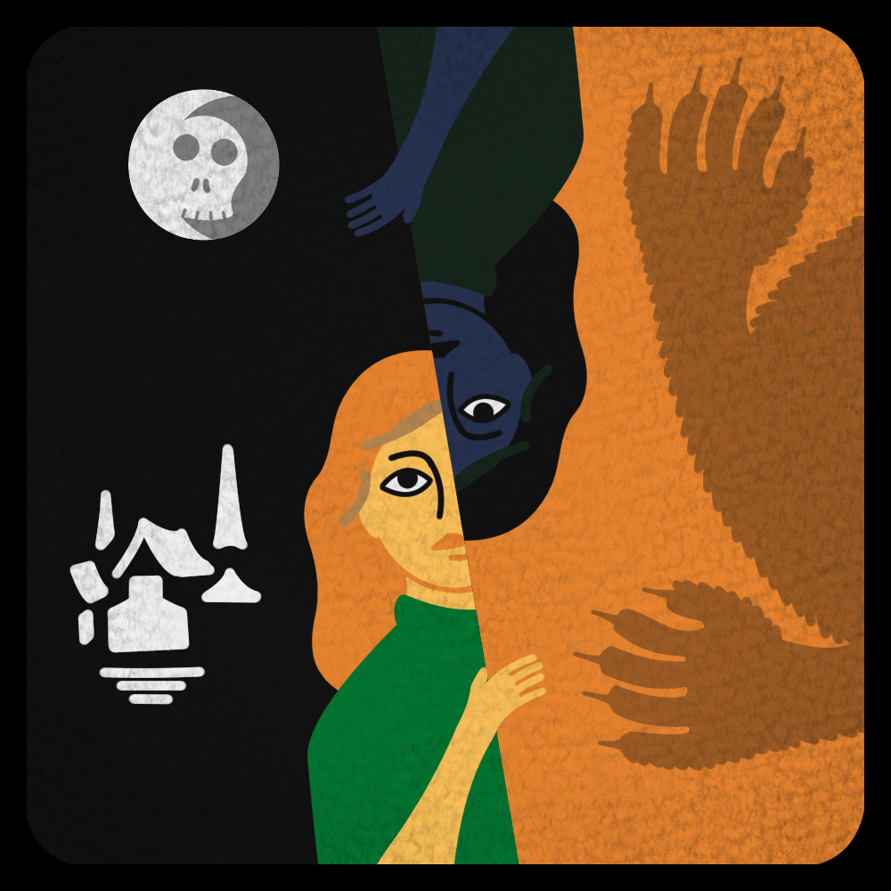

<code>v01</code>

</td>
<td class="role-text-cell" valign="top">

🟩 <code>v01</code> · Menina Aldeões

Categoria: Aldeões · <a href="#lista-rapida-de-personagens">voltar à lista rápida</a>

Cada noite é avisada sobre os jogadores assassinados e vê como eles morreram.

O Narrador mostrará o papel cujo o poder assassinou a vítima.

Se for um Namorado que se suicidou, é-lhe mostrado o papel do Cupido.

Se o assassino era um Soldado, é-lhe mostrado o papel do Capitão.

<strong>Se envenenado:</strong> Receberá a informação errada.

<strong>Objetivo:</strong> Matar todos os Lobisomens.

</td>
</tr>
<tr class="role-row faction-good" id="v02">
<td class="role-image-cell" width="150" valign="top" align="center">
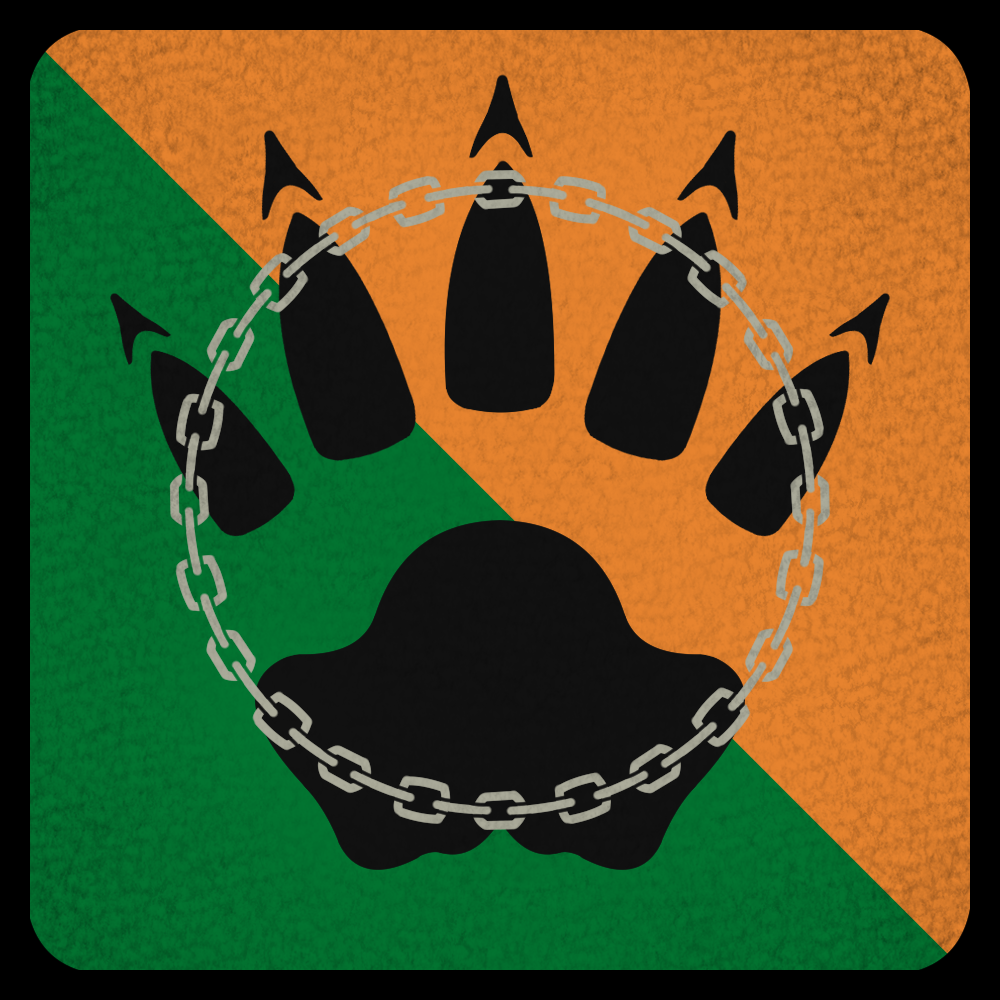

<code>v02</code>

</td>
<td class="role-text-cell" valign="top">

🟩 <code>v02</code> · Domador do Urso Aldeões

Categoria: Aldeões · <a href="#lista-rapida-de-personagens">voltar à lista rápida</a>

A cada noite, se um dos seus vizinhos for uma Criatura Malvada, o Urso rosna.

<strong>Se envenenado:</strong> Receberá a informação errada.

<strong>Objetivo:</strong> Matar todos os Lobisomens.

</td>
</tr>
<tr class="role-row faction-good" id="v03">
<td class="role-image-cell" width="150" valign="top" align="center">
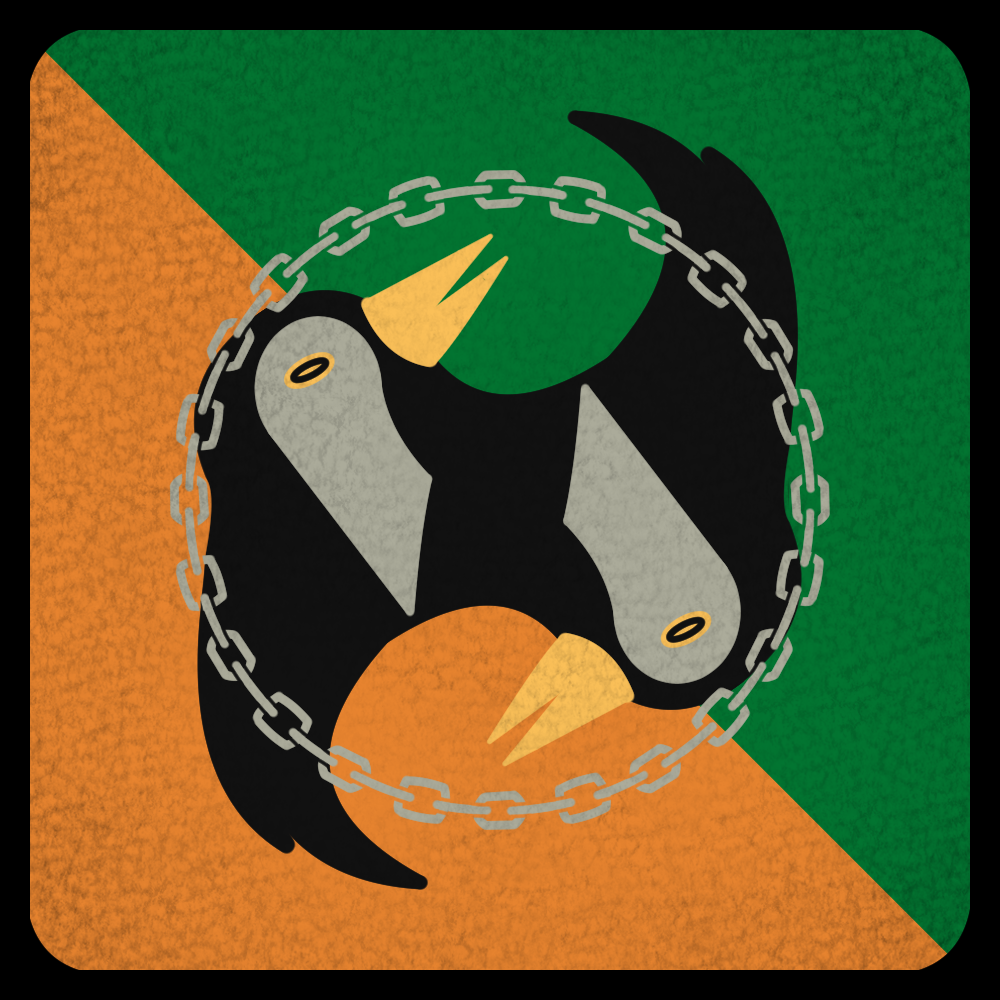

<code>v03</code>

</td>
<td class="role-text-cell" valign="top">

🟩 <code>v03</code> · Domador do Corvo Aldeões

Categoria: Aldeões · <a href="#lista-rapida-de-personagens">voltar à lista rápida</a>

A cada noite, é-lhe revelado silenciosamente quantas Criaturas Malvadas vivas estão em jogo.

<strong>Se envenenado:</strong> Receberá a informação errada.

<strong>Objetivo:</strong> Matar todos os Lobisomens.

</td>
</tr>
<tr class="role-row faction-good" id="v04">
<td class="role-image-cell" width="150" valign="top" align="center">
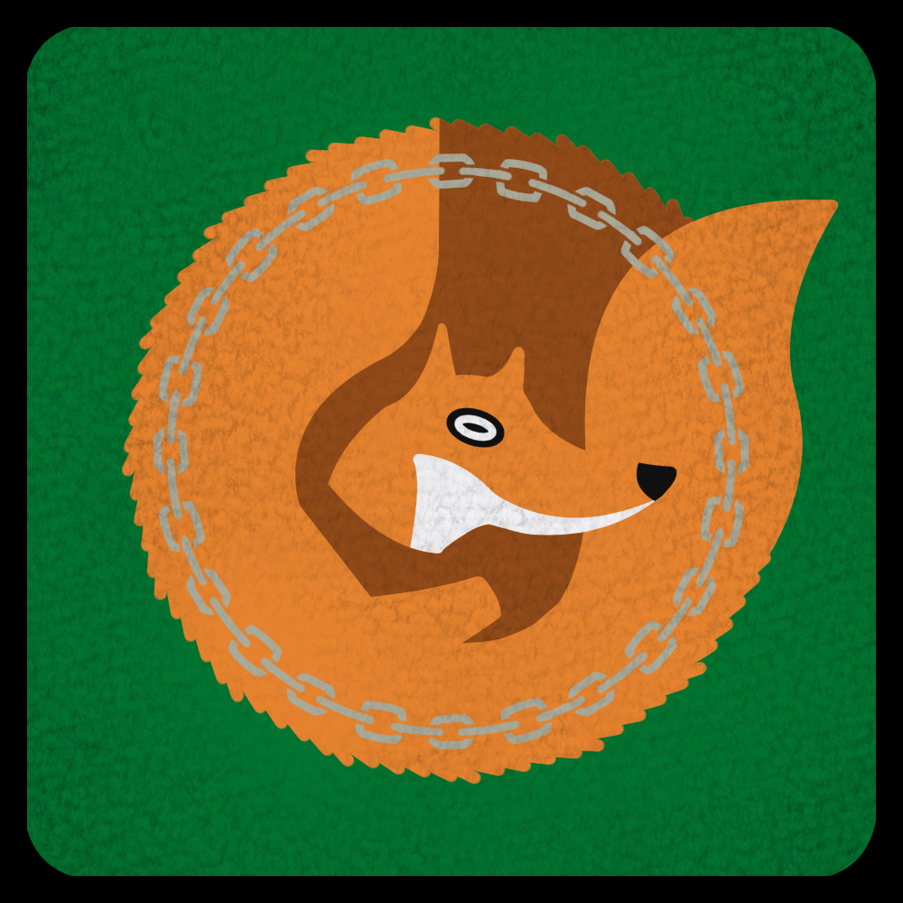

<code>v04</code>

</td>
<td class="role-text-cell" valign="top">

🟩 <code>v04</code> · Domador da Raposa Aldeões

Categoria: Aldeões · <a href="#lista-rapida-de-personagens">voltar à lista rápida</a>

A cada noite, escolhe um jogador e o Narrador revela-lhe se entre ele e os 2 vizinhos há uma Criatura Malvada (👍) ou não (👎).

A partir da segunda noite, se os três forem Aldeões, a Raposa foge e o Domador da Raposa perde o seu poder.

<strong>Se envenenado:</strong> Receberá a informação errada.

<strong>Objetivo:</strong> Matar todos os Lobisomens.

</td>
</tr>
<tr class="role-row faction-good" id="v05">
<td class="role-image-cell" width="150" valign="top" align="center">
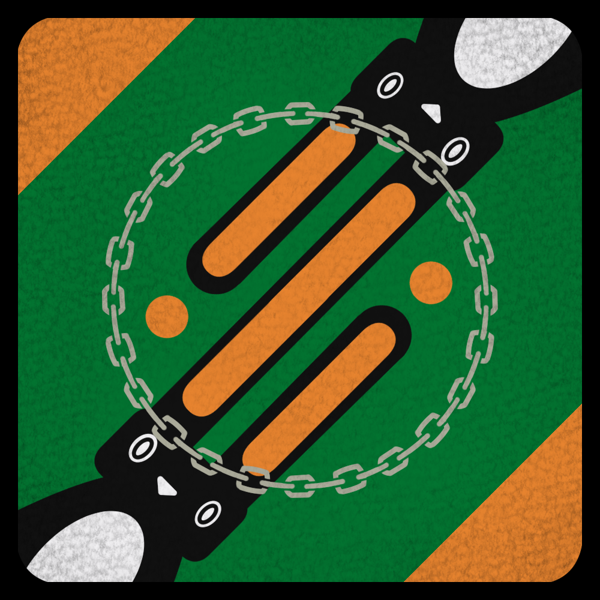

<code>v05</code>

</td>
<td class="role-text-cell" valign="top">

🟩 <code>v05</code> · Domador dos Coelhos Aldeões

Categoria: Aldeões · <a href="#lista-rapida-de-personagens">voltar à lista rápida</a>

A cada noite, se um dos vizinhos ou ele próprio foi atacado pelos Lobisomens ou envenenado pela Bruxa, os coelhos assustam-se.

<strong>Se envenenado:</strong> Receberá a informação errada.

<strong>Objetivo:</strong> Matar todos os Lobisomens.

</td>
</tr>
<tr class="role-row faction-good" id="v06">
<td class="role-image-cell" width="150" valign="top" align="center">
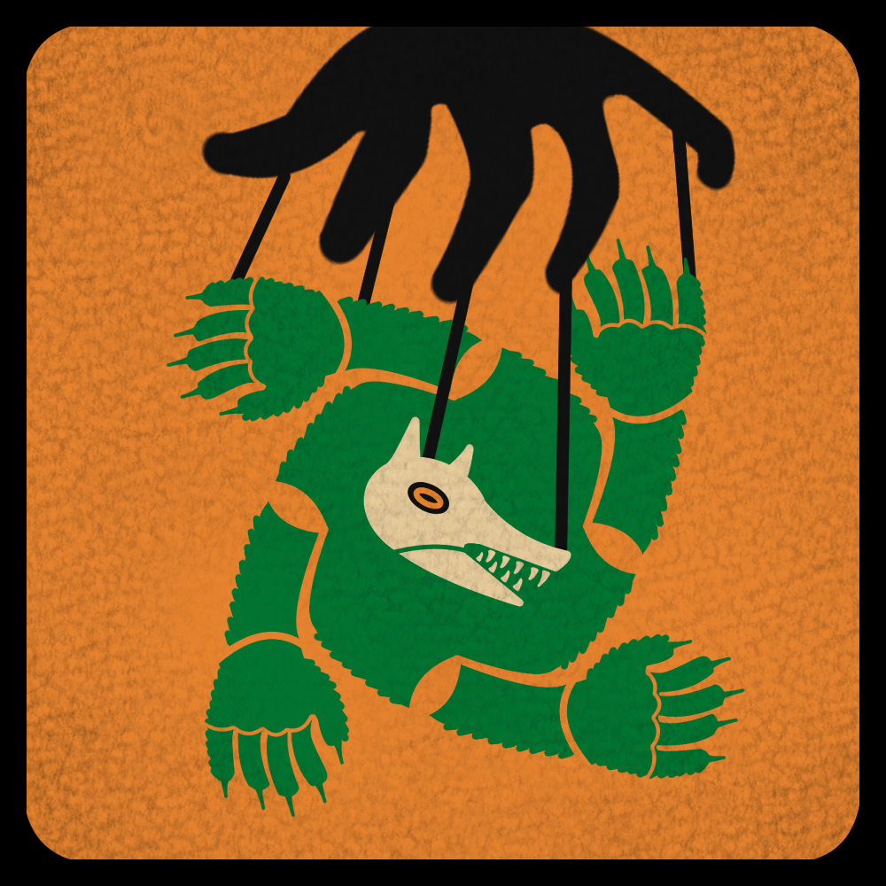

<code>v06</code>

</td>
<td class="role-text-cell" valign="top">

🟩 <code>v06</code> · Marionetista Aldeões

Categoria: Aldeões · <a href="#lista-rapida-de-personagens">voltar à lista rápida</a>

Faz de conta que é um Lobisomem.

Acorda ao mesmo tempo que os Lobisomens e vota com eles.

<strong>Se envenenado:</strong> Não acorda; será tocado pelo Narrador uma vez que a Bruxa Malvada adormeça.

<strong>Objetivo:</strong> Matar todos os Lobisomens.

</td>
</tr>
<tr class="role-row faction-good" id="v07">
<td class="role-image-cell" width="150" valign="top" align="center">
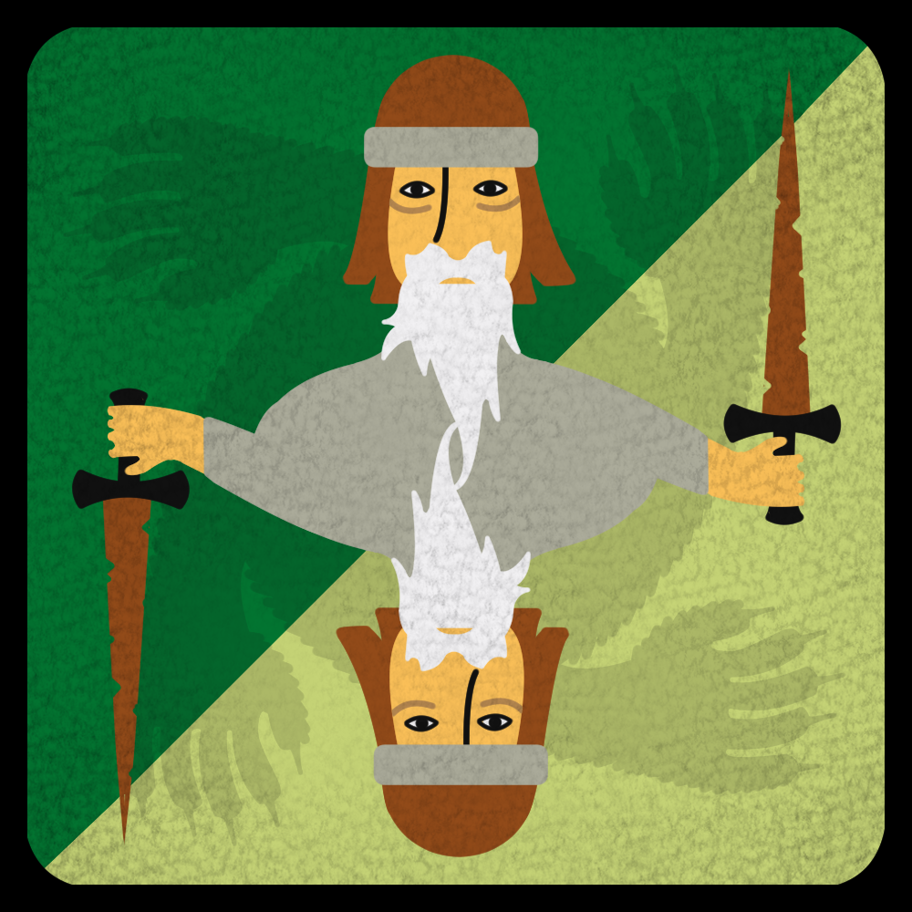

<code>v07</code>

</td>
<td class="role-text-cell" valign="top">

🟩 <code>v07</code> · Cavaleiro Enferrujado Aldeões

Categoria: Aldeões · <a href="#lista-rapida-de-personagens">voltar à lista rápida</a>

Quando morre, o Lobisomem mais próximo morrerá durante o próximo dia. A morte será anunciada no início do Tribunal.

<strong>Se envenenado quando morto:</strong> Assassina o jogador errado.

<strong>Objetivo:</strong> Matar todos os Lobisomens.

</td>
</tr>
<tr class="role-row faction-good" id="v08">
<td class="role-image-cell" width="150" valign="top" align="center">
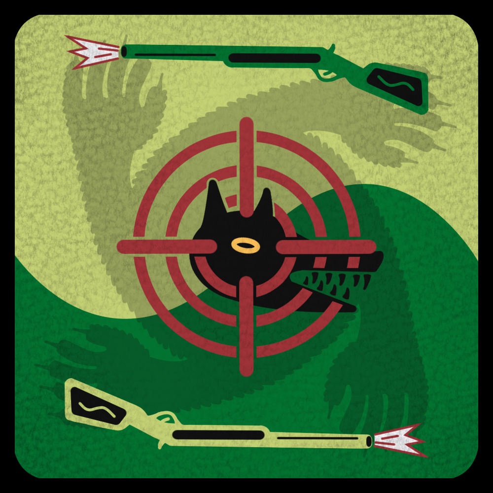

<code>v08</code>

</td>
<td class="role-text-cell" valign="top">

🟩 <code>v08</code> · Caçador Aldeões

Categoria: Aldeões · <a href="#lista-rapida-de-personagens">voltar à lista rápida</a>

Uma vez morto, será acordado na próxima noite para escolher um jogador que deverá assassinar.

Se o Capuchinho Vermelho foi executado, será acordado na próxima noite para escolher um jogador que deverá ser assassinado (Poderá na mesma usar o seu poder quando morrer).

<strong>Se envenenado no momento da morte:</strong> Assassina o jogador errado.

<strong>Objetivo:</strong> Matar todos os Lobisomens.

</td>
</tr>
<tr class="role-row faction-good" id="v08b">
<td class="role-image-cell" width="150" valign="top" align="center">
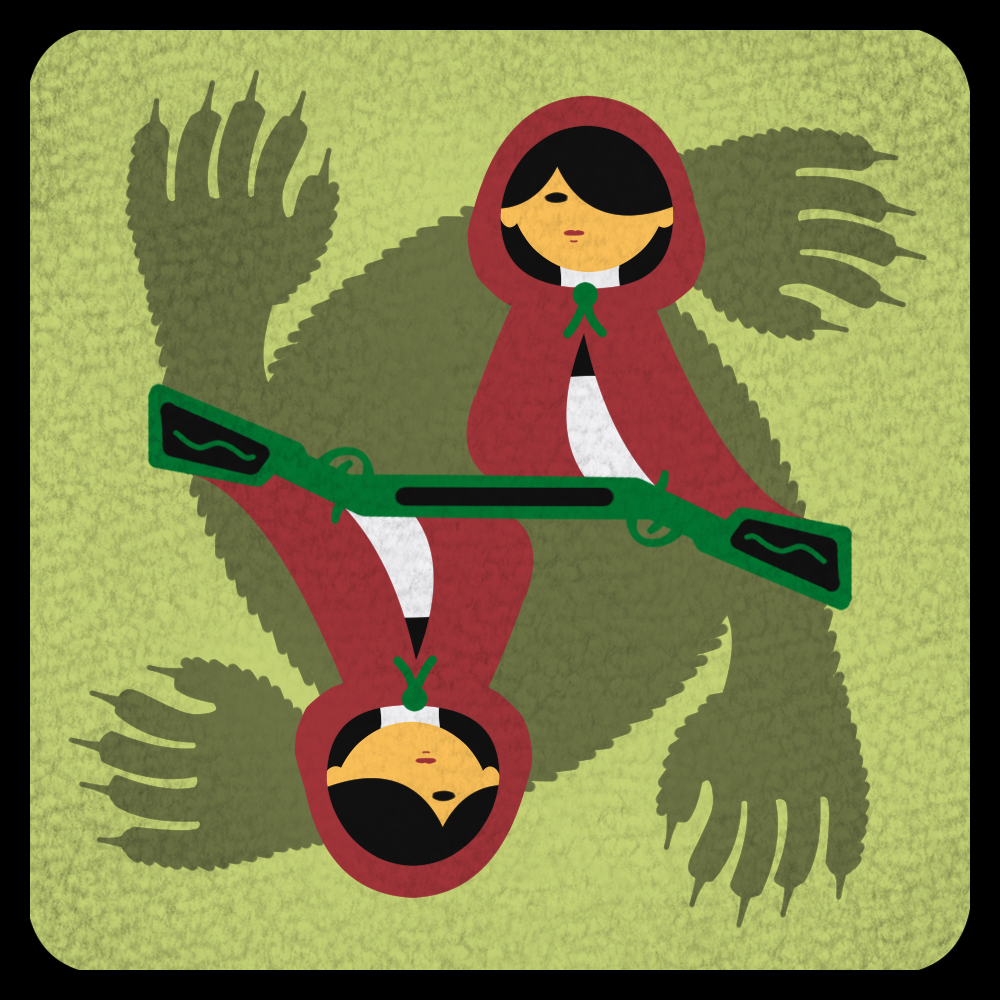

<code>v08b</code>

</td>
<td class="role-text-cell" valign="top">

🟩 <code>v08b</code> · Capuchinho Vermelho Aldeões

Categoria: Aldeões · <a href="#lista-rapida-de-personagens">voltar à lista rápida</a>

É imune aos assassinatos dos Lobisomens enquanto o Caçador estiver vivo.

Se for executada enquanto o Caçador estiver vivo, o Caçador pode matar alguém na próxima noite.

<strong>Se envenenado:</strong> Perde a imunidade essa noite.

<strong>Objetivo:</strong> Matar todos os Lobisomens.

</td>
</tr>
<tr class="role-row faction-good" id="v09">
<td class="role-image-cell" width="150" valign="top" align="center">
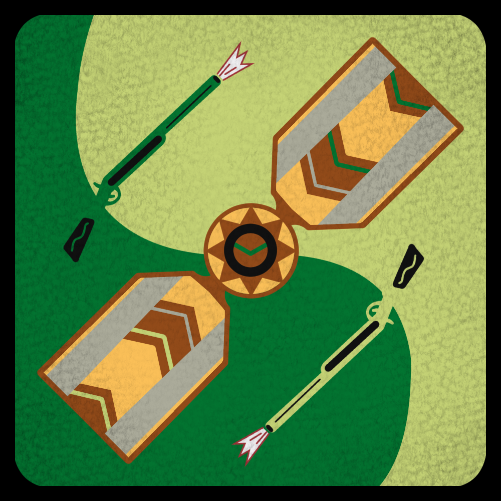

<code>v09</code>

</td>
<td class="role-text-cell" valign="top">

🟩 <code>v09</code> · Capitão Aldeões

Categoria: Aldeões · <a href="#lista-rapida-de-personagens">voltar à lista rápida</a>

Cada noite, escolhe um jogador que será um Soldado durante essa noite e dia. O Soldado será tocado pelo Narrador.

Se o Soldado morrer, poderá matar alguém na noite seguinte.

<strong>Se envenenado:</strong> O poder afeta o jogador errado.

<strong>Objetivo:</strong> Matar todos os Lobisomens.

</td>
</tr>
<tr class="role-row faction-good" id="v10">
<td class="role-image-cell" width="150" valign="top" align="center">
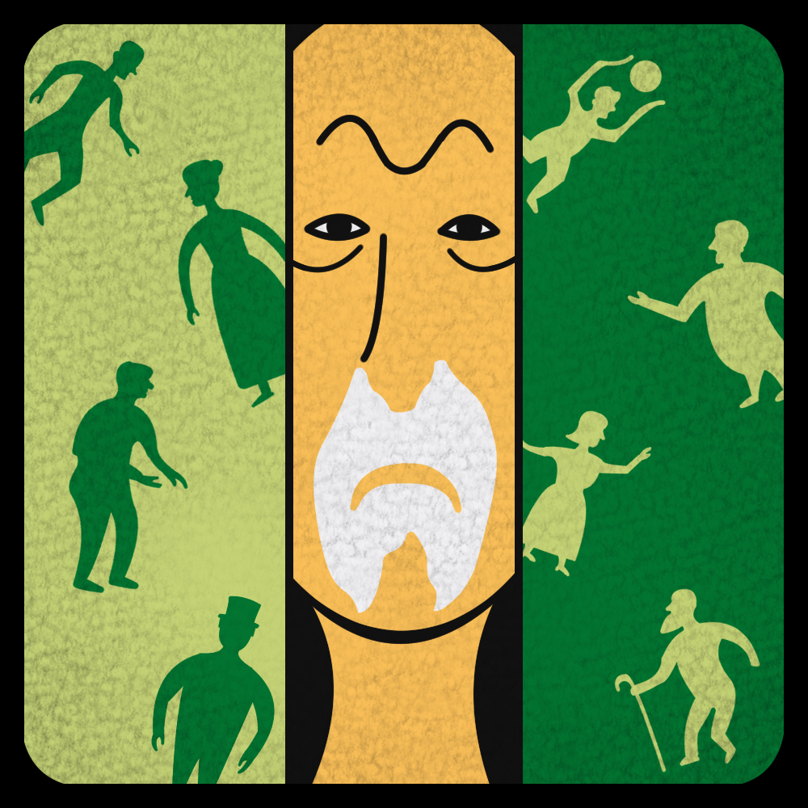

<code>v10</code>

</td>
<td class="role-text-cell" valign="top">

🟩 <code>v10</code> · Paranoico Aldeões

Categoria: Aldeões · <a href="#lista-rapida-de-personagens">voltar à lista rápida</a>

Duas vezes no jogo, durante o dia, pode dizer discretamente ao Narrador para assassinar uma pessoa cuja morte será anunciada no início do Tribunal.

<strong>Se envenenado:</strong> Assassina o jogador errado.

<strong>Objetivo:</strong> Matar todos os Lobisomens.

</td>
</tr>
<tr class="role-row faction-good" id="v11">
<td class="role-image-cell" width="150" valign="top" align="center">
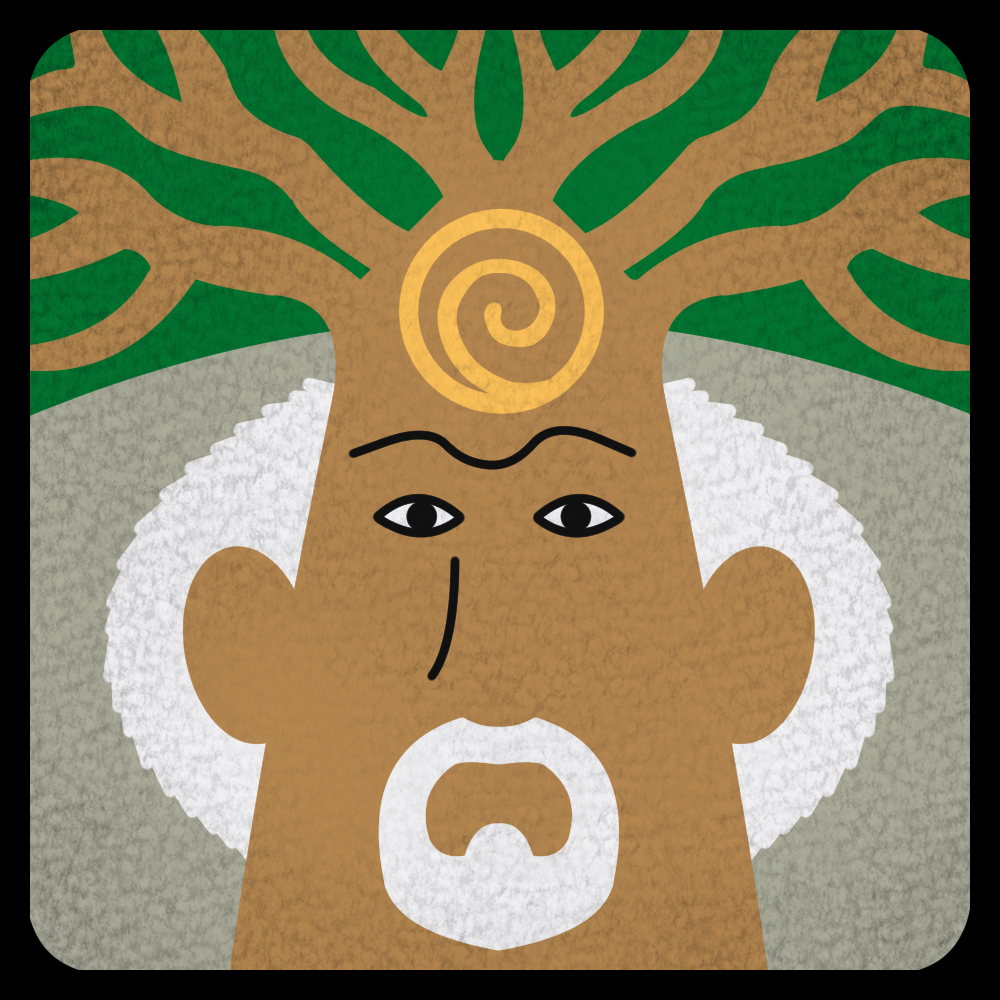

<code>v11</code>

</td>
<td class="role-text-cell" valign="top">

🟩 <code>v11</code> · Chefe da Aldeia Aldeões

Categoria: Aldeões · <a href="#lista-rapida-de-personagens">voltar à lista rápida</a>

A cada noite, escolhe um jogador que terá automaticamente 2 votos a mais contra ele se for a Tribunal nesse dia.

<strong>Se envenenado:</strong> Os votos do jogador escolhido contam a dobrar.

<strong>Objetivo:</strong> Matar todos os Lobisomens.

</td>
</tr>
<tr class="role-row faction-good" id="v12">
<td class="role-image-cell" width="150" valign="top" align="center">
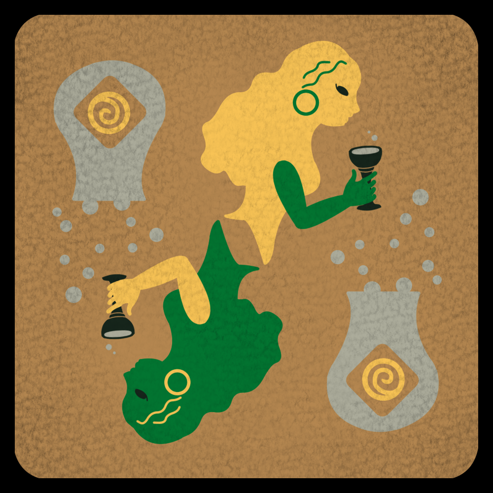

<code>v12</code>

</td>
<td class="role-text-cell" valign="top">

🟩 <code>v12</code> · Cigana Aldeões

Categoria: Aldeões · <a href="#lista-rapida-de-personagens">voltar à lista rápida</a>

A cada noite, escolhe um jogador e o Narrador revela-lhe se entre ele e os 2 vizinhos há um jogador envenenado.

Se for o caso, ela será avisada (👍/👎), esse jogador perde o veneno e a Cigana fica envenenada.

<strong>Se envenenado :</strong> O voto dela conta a dobrar.

<strong>Objetivo:</strong> Matar todos os Lobisomens.

</td>
</tr>
<tr class="role-row faction-good" id="v13">
<td class="role-image-cell" width="150" valign="top" align="center">
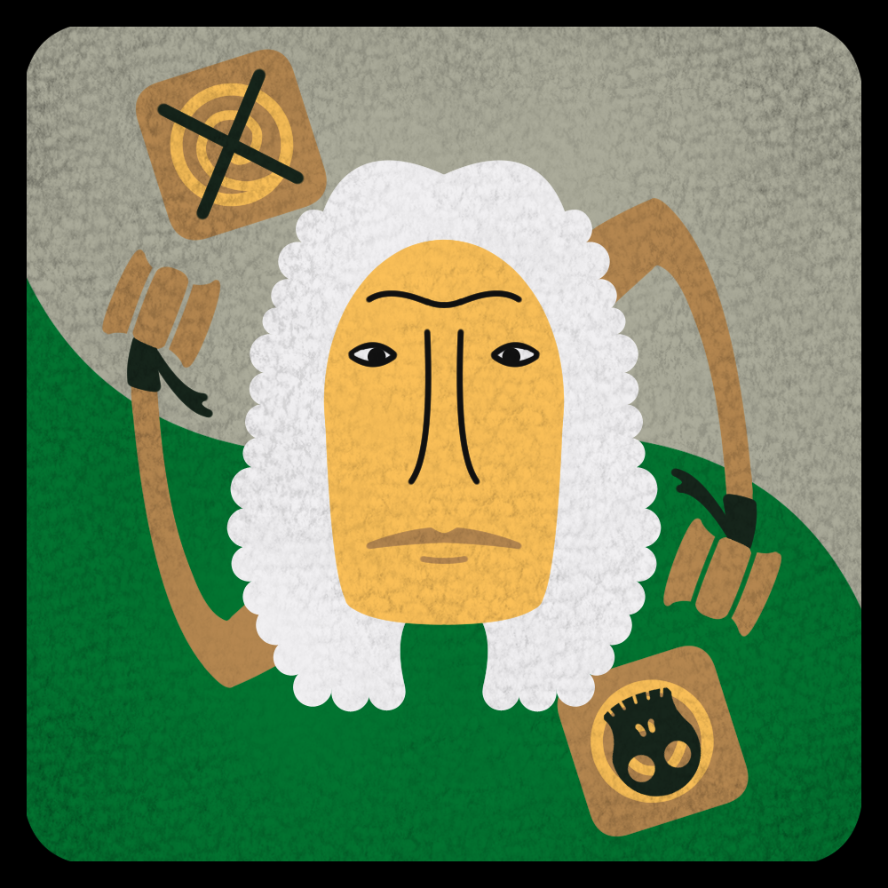

<code>v13</code>

</td>
<td class="role-text-cell" valign="top">

🟩 <code>v13</code> · Juiz Aldeões

Categoria: Aldeões · <a href="#lista-rapida-de-personagens">voltar à lista rápida</a>

Duas vezes durante todo o jogo, pode-se revelar e anular uma execução durante o Tribunal.

Só pode usar este poder uma vez por dia.

Se assassinado, o Fantasma pode continuar a votar e o seu voto conta o dobro.

<strong>Se envenenado:</strong> A anulação não tem efeito.

<strong>Objetivo:</strong> Matar todos os Lobisomens.

</td>
</tr>
<tr class="role-row faction-good" id="v14">
<td class="role-image-cell" width="150" valign="top" align="center">
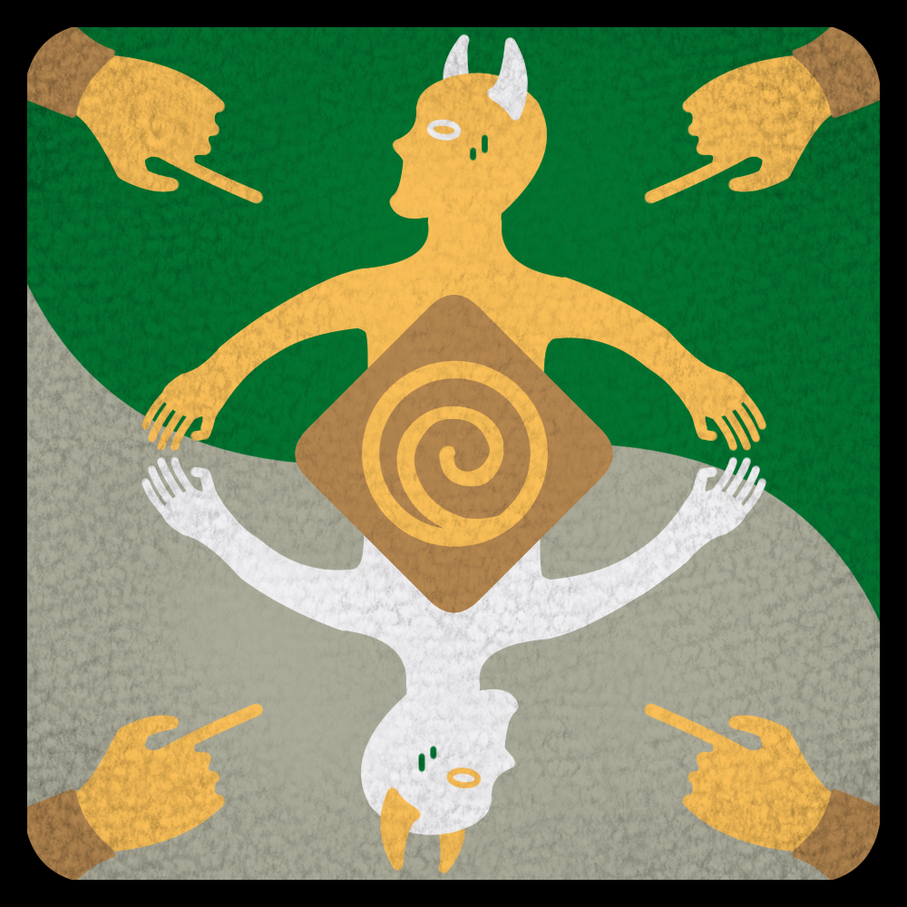

<code>v14</code>

</td>
<td class="role-text-cell" valign="top">

🟩 <code>v14</code> · Acusador Aldeões

Categoria: Aldeões · <a href="#lista-rapida-de-personagens">voltar à lista rápida</a>

Duas vezes durante todo o jogo, pode-se revelar e forçar uma execução durante o Tribunal.

Só pode usar o poder uma vez por dia.

<strong>Se envenenado:</strong> A execução não tem efeito.

<strong>Objetivo:</strong> Matar todos os Lobisomens.

</td>
</tr>
<tr class="role-row faction-good" id="v15">
<td class="role-image-cell" width="150" valign="top" align="center">
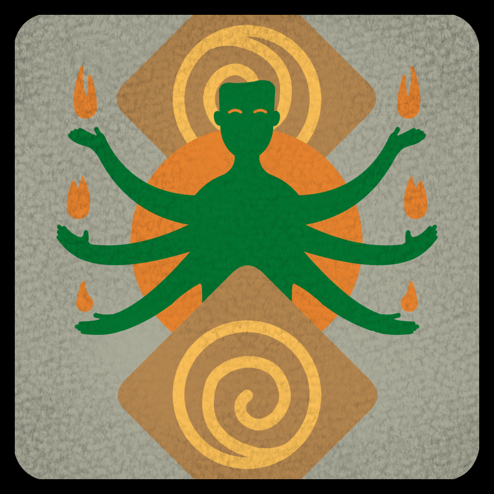

<code>v15</code>

</td>
<td class="role-text-cell" valign="top">

🟩 <code>v15</code> · Piromaníaco Aldeões

Categoria: Aldeões · <a href="#lista-rapida-de-personagens">voltar à lista rápida</a>

Quando um jogador é chamado ao tribunal, mas não é executado, o Piromaníaco pode escolher na noite seguinte incendiar a casa desse jogador (👍/👎).

Esse jogador morre se for um Lobisomem, senão, perde os seus poderes permanentemente.

<strong>Se envenenado :</strong> Incendiará a casa errada.

<strong>Objetivo:</strong> Matar todos os Lobisomens.

</td>
</tr>
<tr class="role-row faction-good" id="v16">
<td class="role-image-cell" width="150" valign="top" align="center">
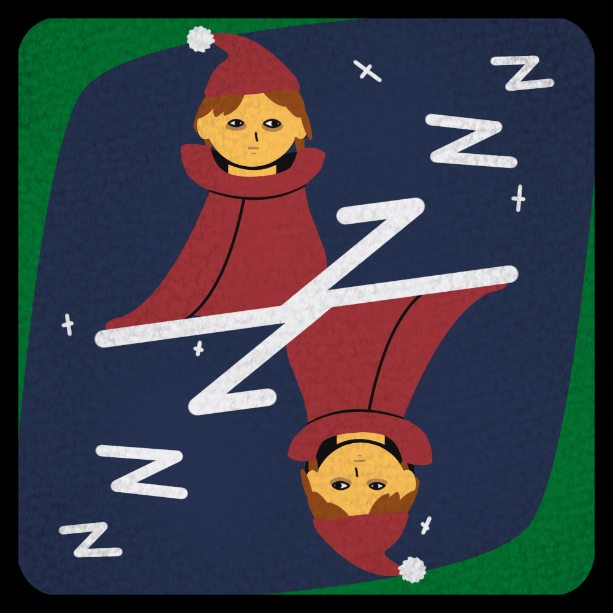

<code>v16</code>

</td>
<td class="role-text-cell" valign="top">

🟩 <code>v16</code> · Sonâmbulo Aldeões

Categoria: Aldeões · <a href="#lista-rapida-de-personagens">voltar à lista rápida</a>

Cada início de noite escolhe um jogador para visitar.

Esse jogador será tocado e não será chamado essa noite.

Se esse jogador for chamado na mesma (por ex. Lobisomens), não acorda.

<strong>Se envenenado na noite passada:</strong> Vai dormir na casa do jogador errado.

<strong>Objetivo:</strong> Matar todos os Lobisomens.

</td>
</tr>
<tr class="role-row faction-good" id="v17">
<td class="role-image-cell" width="150" valign="top" align="center">
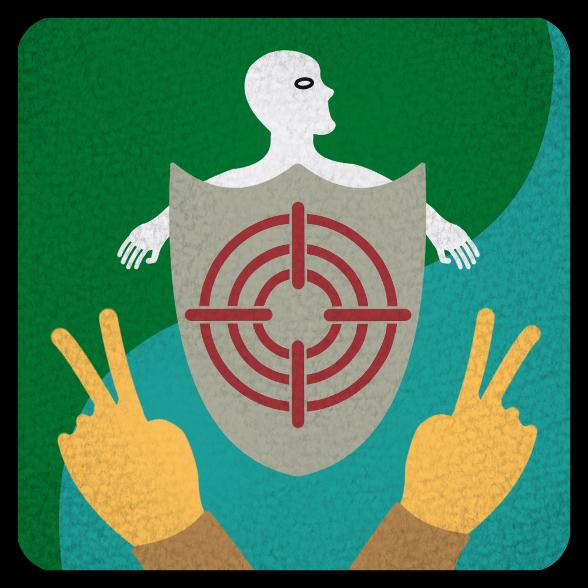

<code>v17</code>

</td>
<td class="role-text-cell" valign="top">

🟩 <code>v17</code> · Salvador Aldeões

Categoria: Aldeões · <a href="#lista-rapida-de-personagens">voltar à lista rápida</a>

Cada noite, escolhe um jogador que será imune durante essa noite e esse dia.

Também se pode escolher a si próprio.

<strong>Se envenenado:</strong> Dá imunidade ao jogador errado.

<strong>Objetivo:</strong> Matar todos os Lobisomens.

</td>
</tr>
<tr class="role-row faction-good" id="v18">
<td class="role-image-cell" width="150" valign="top" align="center">
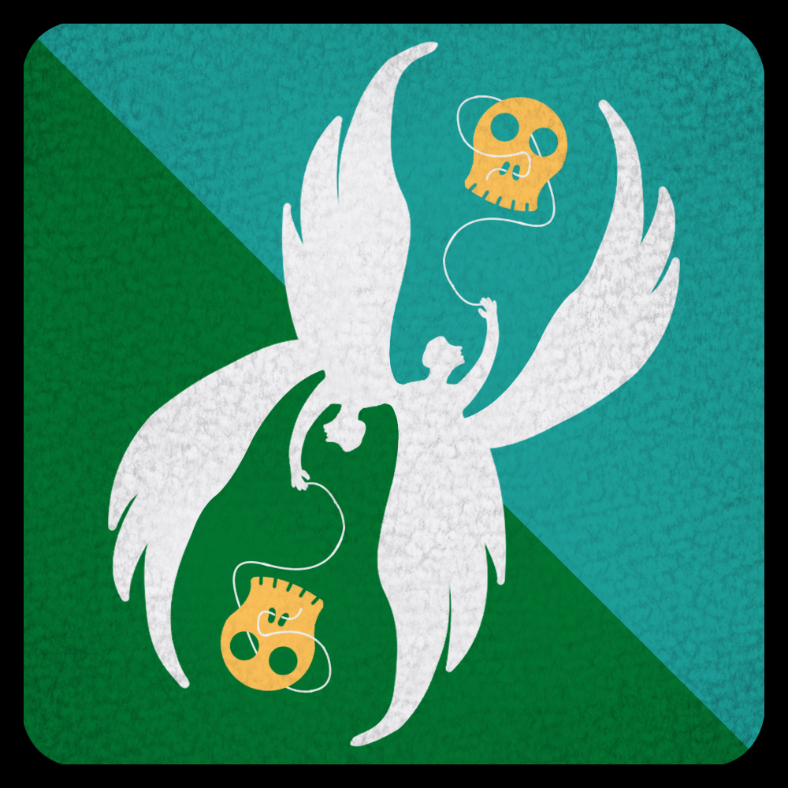

<code>v18</code>

</td>
<td class="role-text-cell" valign="top">

🟩 <code>v18</code> · Anjo Aldeões

Categoria: Aldeões · <a href="#lista-rapida-de-personagens">voltar à lista rápida</a>

Pode ressuscitar dois Fantasmas durante todo o jogo.

Se o Fantasma tinha um poder com usos limitados, recupera todos os usos quando ressuscitado.

(Pode pedir discretamente a qualquer momento ao Narrador; o jogador ressuscitará na próxima noite)

<strong>Se envenenado:</strong> Ressuscita o jogador errado.

<strong>Objetivo:</strong> Matar todos os Lobisomens.

</td>
</tr>
<tr class="role-row faction-good" id="v19">
<td class="role-image-cell" width="150" valign="top" align="center">
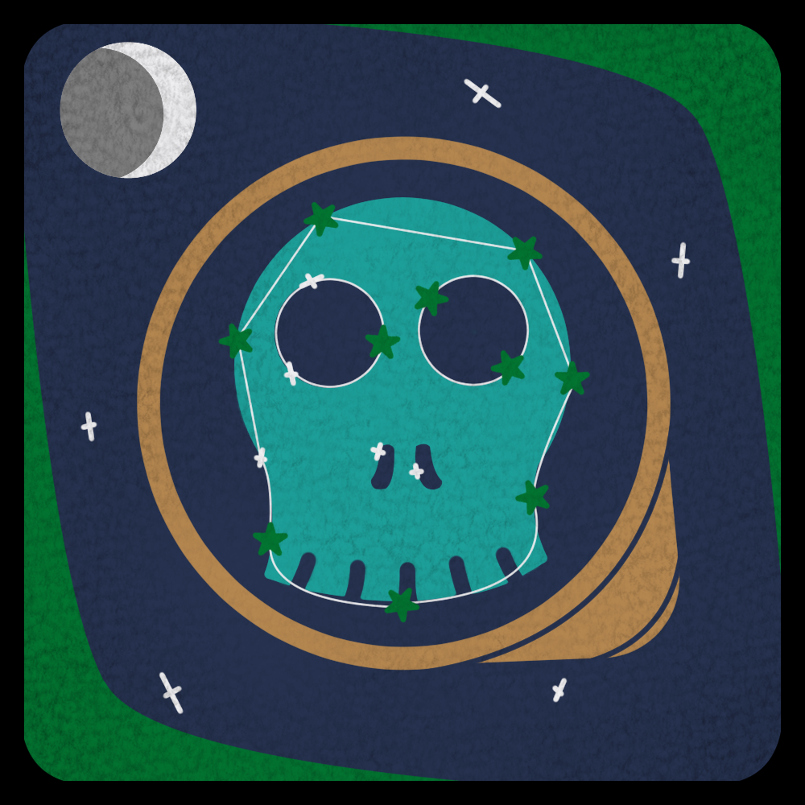

<code>v19</code>

</td>
<td class="role-text-cell" valign="top">

🟩 <code>v19</code> · Profeta Aldeões

Categoria: Aldeões · <a href="#lista-rapida-de-personagens">voltar à lista rápida</a>

Cada fim de noite, o Profeta aponta para um jogador que acha que morreu durante essa noite.

Se a profecia estiver certa (👍), esse jogador será tocado e guardará os seus poderes enquanto Fantasma durante o próximo dia e noite.

Se era um personagem com um poder com usos limitados, pode usar o poder de qualquer maneira.

<strong>Se envenenado:</strong> A profecia está errada de qualquer maneira.

<strong>Objetivo:</strong> Matar todos os Lobisomens.

</td>
</tr>
<tr class="role-row faction-good" id="v20">
<td class="role-image-cell" width="150" valign="top" align="center">
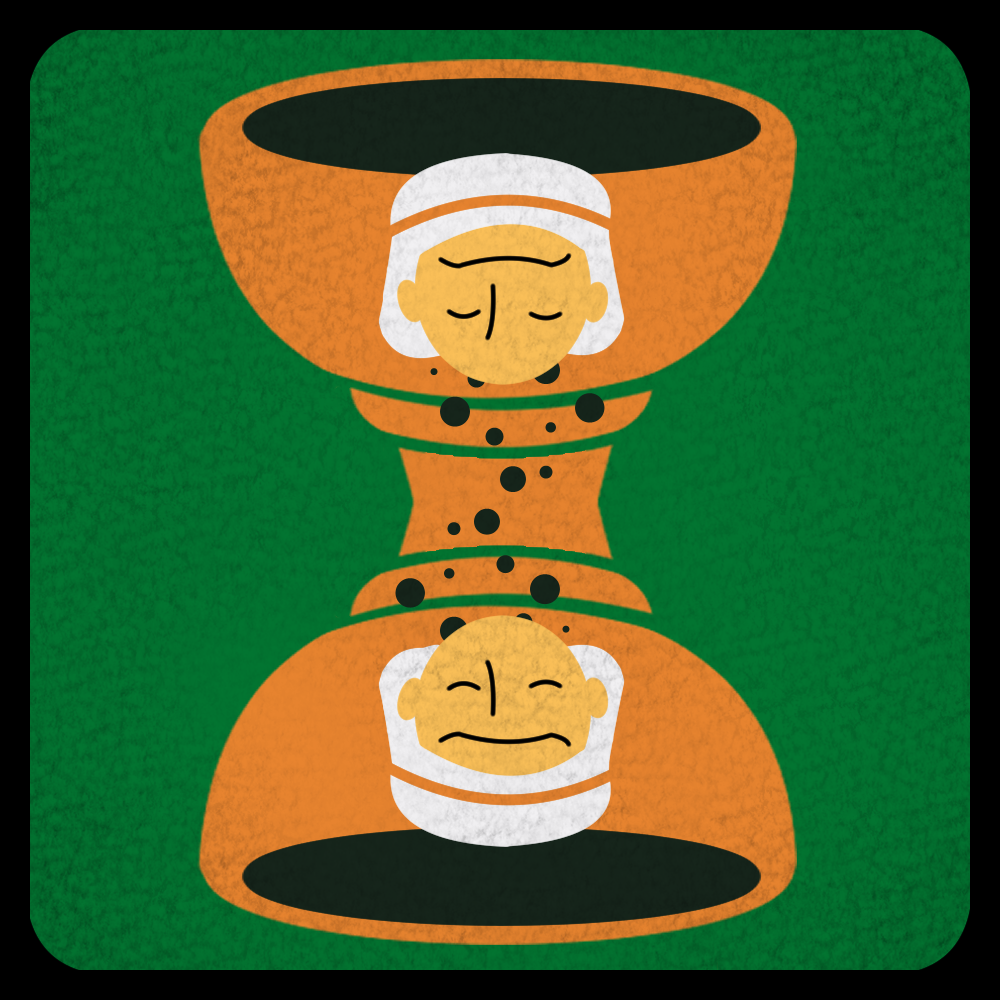

<code>v20</code>

</td>
<td class="role-text-cell" valign="top">

🟩 <code>v20</code> · Empregada Aldeões

Categoria: Aldeões · <a href="#lista-rapida-de-personagens">voltar à lista rápida</a>

Cada noite, é-lhe revelada a distância até a pessoa envenenada

(Ex.: 3 = a terceira pessoa à esquerda ou à direita).

<strong>Se envenenado:</strong> Receberá a informação errada.

<strong>Objetivo:</strong> Matar todos os Lobisomens.

</td>
</tr>
<tr class="role-row faction-good" id="v21">
<td class="role-image-cell" width="150" valign="top" align="center">
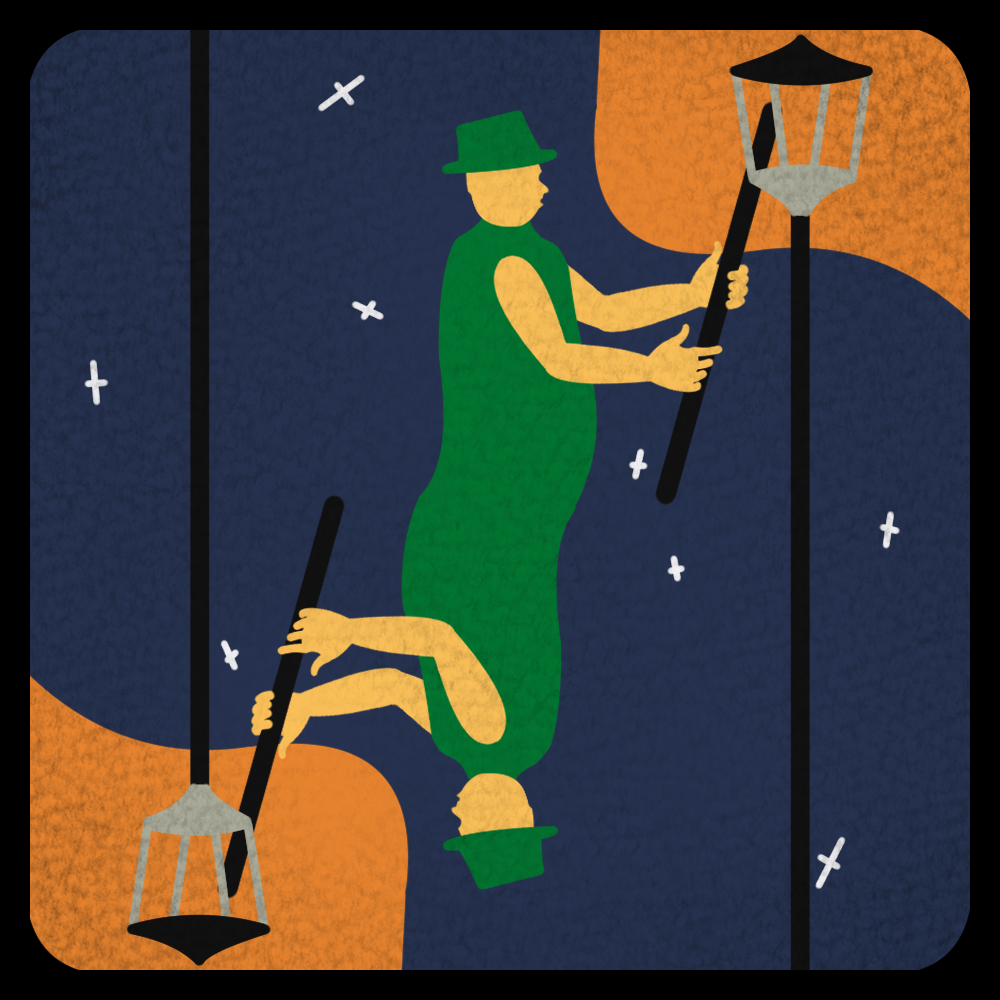

<code>v21</code>

</td>
<td class="role-text-cell" valign="top">

🟩 <code>v21</code> · Faroleiro Aldeões

Categoria: Aldeões · <a href="#lista-rapida-de-personagens">voltar à lista rápida</a>

Cada noite, é-lhe mostrado um personagem em jogo com um poder com usos limitados e é informado de quantos usos esse personagem ainda tem.

<strong>Se envenenado:</strong> Receberá a informação errada.

<strong>Objetivo:</strong> Matar todos os Lobisomens.

</td>
</tr>
<tr class="role-row faction-good" id="v22">
<td class="role-image-cell" width="150" valign="top" align="center">
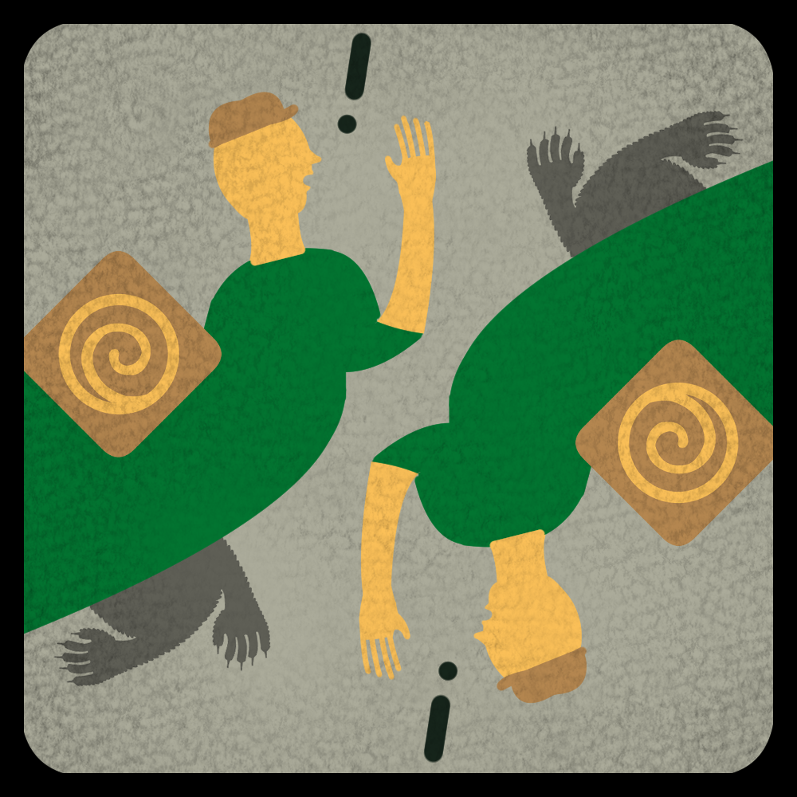

<code>v22</code>

</td>
<td class="role-text-cell" valign="top">

🟩 <code>v22</code> · Pedro Aldeões

Categoria: Aldeões · <a href="#lista-rapida-de-personagens">voltar à lista rápida</a>

Cada vez que leva um jogador a Tribunal, é-lhe revelado na noite seguinte se esse jogador era um Lobisomem ou não.

Nunca pode levar o mesmo jogador a Tribunal duas vezes.

<strong>Se envenenado:</strong> Receberá a informação errada.

<strong>Objetivo:</strong> Matar todos os Lobisomens.

</td>
</tr>
<tr class="role-row faction-good" id="v23">
<td class="role-image-cell" width="150" valign="top" align="center">
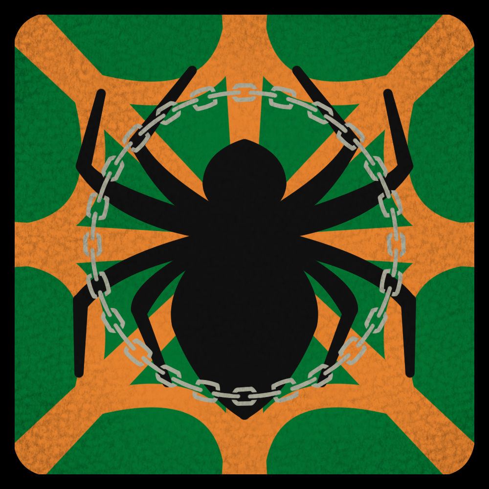

<code>v23</code>

</td>
<td class="role-text-cell" valign="top">

🟩 <code>v23</code> · Domador da Aranha Aldeões

Categoria: Aldeões · <a href="#lista-rapida-de-personagens">voltar à lista rápida</a>

Na primeira noite, escolhe um jogador no qual tece uma teia de aranha.

Cada noite depois da primeira, o Domador da Aranha será mostrado as cartas que durante a noite apontaram o jogador com a teia.

Na noite seguinte à morte do jogador com a teia de aranha, o Domador da Aranha é acordado para escolher um novo.

Uma vez no jogo, durante o dia, pode dizer discretamente ao Narrador para mudar o jogador com a teia antes da morte dele.

<strong>Se envenenado:</strong> Receberá a informação errada.

<strong>Objetivo:</strong> Matar todos os Lobisomens.

</td>
</tr>
</tbody>
</table>
---

### Personagens malvados

<table class="character-table">
<colgroup>
<col class="image-col" width="150">
<col>
</colgroup>
<thead>
<tr>
<th width="150">Carta</th>
<th>Descrição</th>
</tr>
</thead>
<tbody>
<tr class="role-row faction-evil" id="m01">
<td class="role-image-cell" width="150" valign="top" align="center">
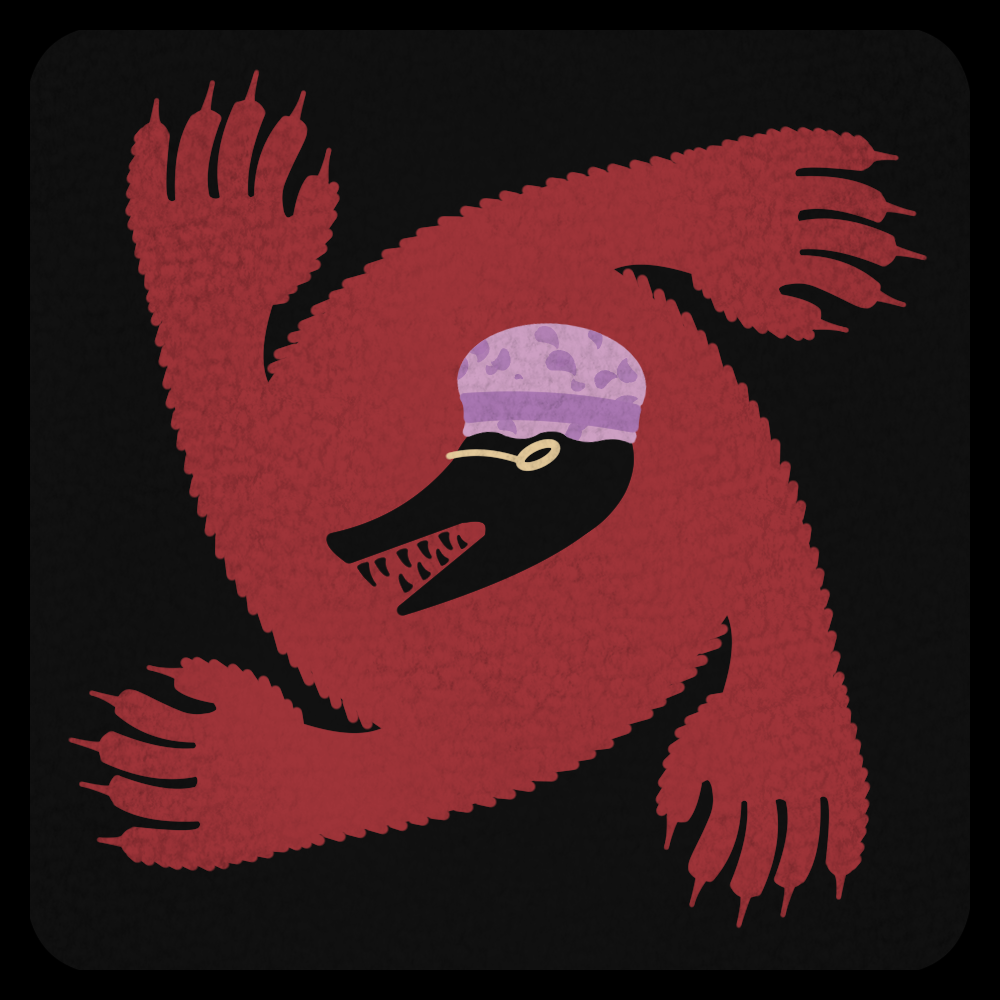

<code>m01</code>

</td>
<td class="role-text-cell" valign="top">

🟥 <code>m01</code> · Lobisomem Mau Criaturas Malvadas

Categoria: Personagens malvados · <a href="#lista-rapida-de-personagens">voltar à lista rápida</a>

Duas vezes por jogo, escolhe se quer se mascarar de Avózinha (👍/👎), dando-lhe imunidade durante um dia e uma noite.

Mesmo imune, pode ser executado se quem o levar a tribunal for o Capuchinho Vermelho. E nesse caso, se o Caçador votar, o Lobisomem Mau é automaticamente executado.

<strong>Se qualquer Lobisomem estiver envenenado:</strong> Não podem matar.

<strong>Objetivo:</strong> Matar todos os Aldeões.

</td>
</tr>
<tr class="role-row faction-evil" id="m02">
<td class="role-image-cell" width="150" valign="top" align="center">
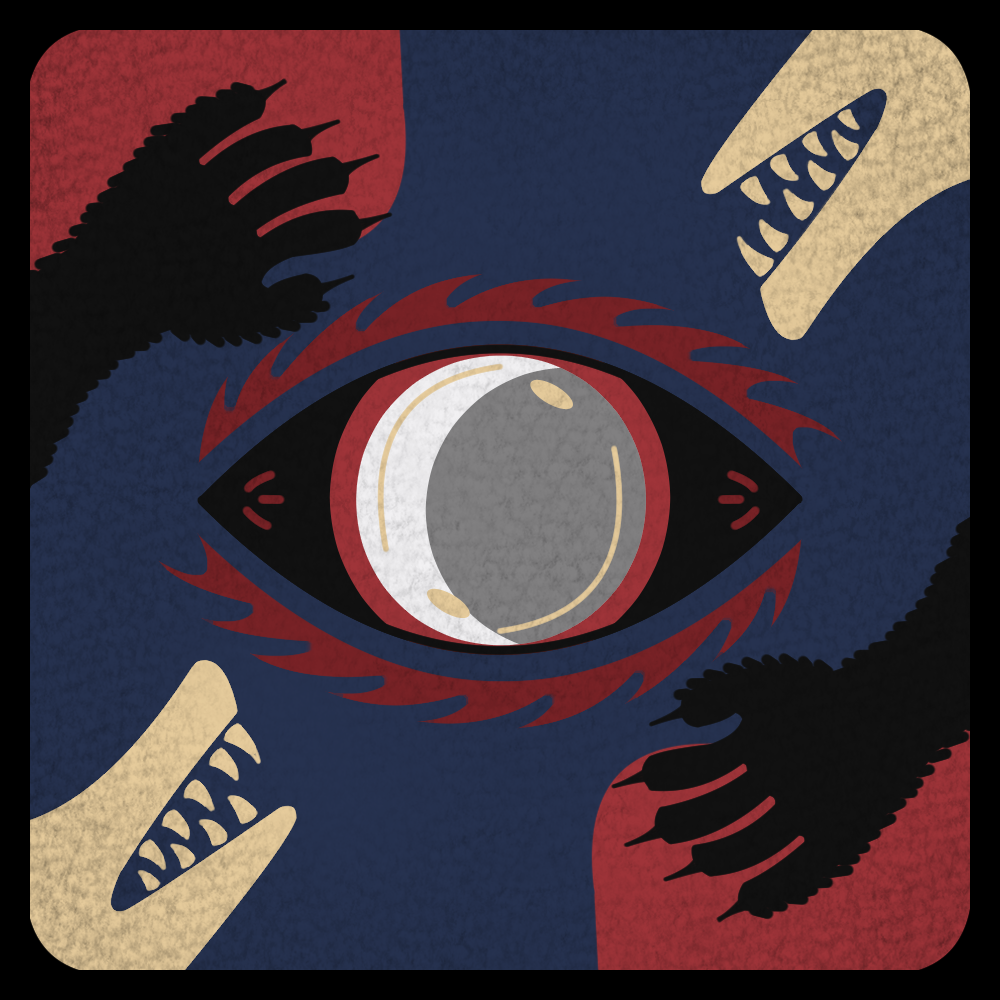

<code>m02</code>

</td>
<td class="role-text-cell" valign="top">

🟥 <code>m02</code> · Lobisomem Vidente Criaturas Malvadas

Categoria: Personagens malvados · <a href="#lista-rapida-de-personagens">voltar à lista rápida</a>

Após os Lobisomens terem escolhido a sua vítima, o Lobisomem Vidente pode escolher NÃO DEIXAR MATAR esse jogador, mas em vez disso, ver o seu papel.

<strong>Se qualquer Lobisomem estiver envenenado:</strong> Não podem matar.

<strong>Objetivo:</strong> Matar todos os Aldeões.

</td>
</tr>
<tr class="role-row faction-evil" id="m03">
<td class="role-image-cell" width="150" valign="top" align="center">
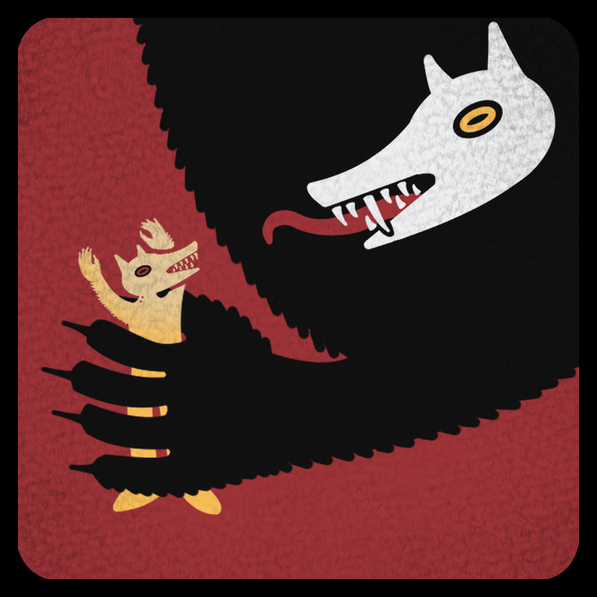

<code>m03</code>

</td>
<td class="role-text-cell" valign="top">

🟥 <code>m03</code> · Lobisomem Vampiro Criaturas Malvadas

Categoria: Personagens malvados · <a href="#lista-rapida-de-personagens">voltar à lista rápida</a>

Uma só vez durante todo o jogo, pode transformar a vítima dos Lobisomens em Lobisomem.

A vítima será avisada e guarda os seus poderes de Aldeão se quiser (👍/👎) mas joga com o objetivo dos Lobisomens.

Se a vítima tiver um poder com usos limitados, recupera todos os usos quando transformada.

<strong>Se qualquer Lobisomem estiver envenenado:</strong> Não podem matar.

<strong>Objetivo:</strong> Matar todos os Aldeões.

</td>
</tr>
<tr class="role-row faction-evil" id="m04">
<td class="role-image-cell" width="150" valign="top" align="center">
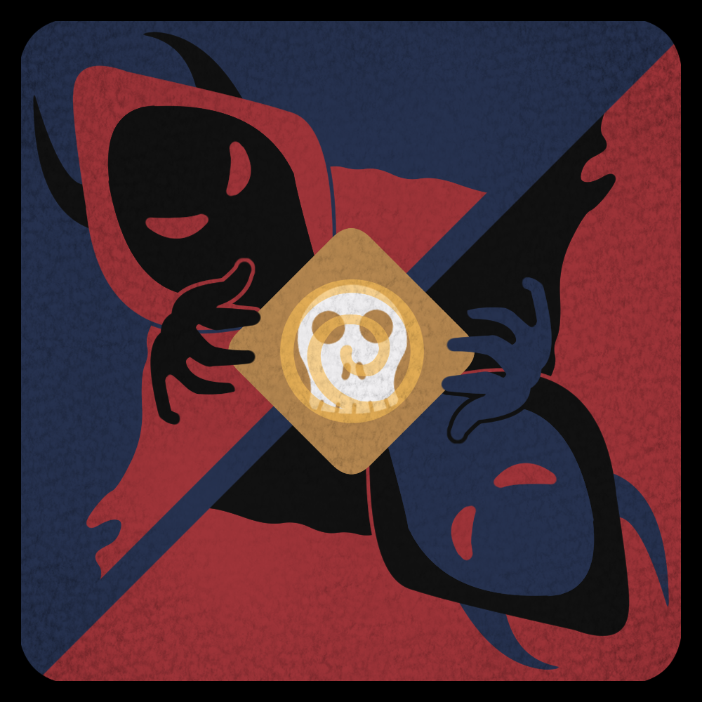

<code>m04</code>

</td>
<td class="role-text-cell" valign="top">

🟥 <code>m04</code> · Ankou Criaturas Malvadas

Categoria: Personagens malvados · <a href="#lista-rapida-de-personagens">voltar à lista rápida</a>

NÃO ACORDA COM OS LOBISOMENS.

Se morto por execução, o Fantasma pode continuar a votar e seu voto vale o dobro.

<strong>Se envenenado:</strong> Sem efeito.

<strong>Objetivo:</strong> Matar todos os Aldeões.

</td>
</tr>
<tr class="role-row faction-evil" id="m05">
<td class="role-image-cell" width="150" valign="top" align="center">
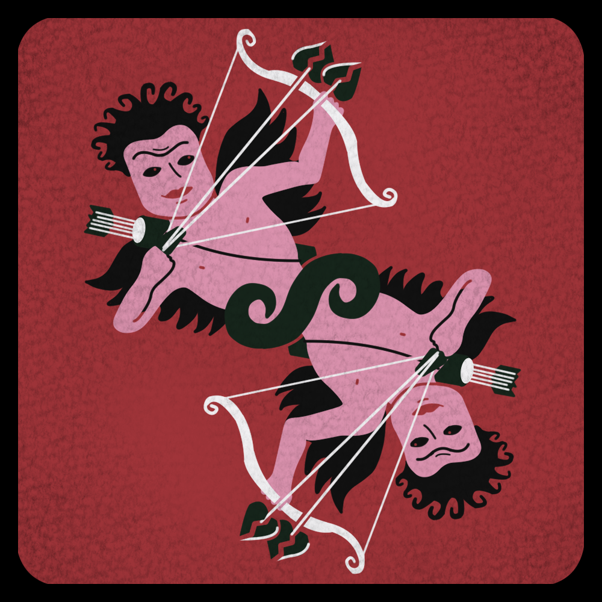

<code>m05</code>

</td>
<td class="role-text-cell" valign="top">

🟥 <code>m05</code> · Cupido Malvado Criaturas Malvadas

Categoria: Personagens malvados · <a href="#lista-rapida-de-personagens">voltar à lista rápida</a>

NÃO ACORDA COM OS LOBISOMENS.

<strong>Na primeira noite é chamado a escolher dois jogadores que serão Inimigos:</strong> Se um Inimigo conseguir condenar o outro a execução, o primeiro recebe imunidade contra a próxima tentativa de assassinato.

A cada vez que um dos Inimigos morre, o Cupido Malvado é acordado para escolher um novo Inimigo para o sobrevivente.

<strong>Se envenenado:</strong> Sem efeito.

<strong>Objetivo:</strong> Matar todos os Aldeões.

</td>
</tr>
</tbody>
</table>
---

### Personagens independentes

<table class="character-table">
<colgroup>
<col class="image-col" width="150">
<col>
</colgroup>
<thead>
<tr>
<th width="150">Carta</th>
<th>Descrição</th>
</tr>
</thead>
<tbody>
<tr class="role-row faction-independent" id="s01">
<td class="role-image-cell" width="150" valign="top" align="center">
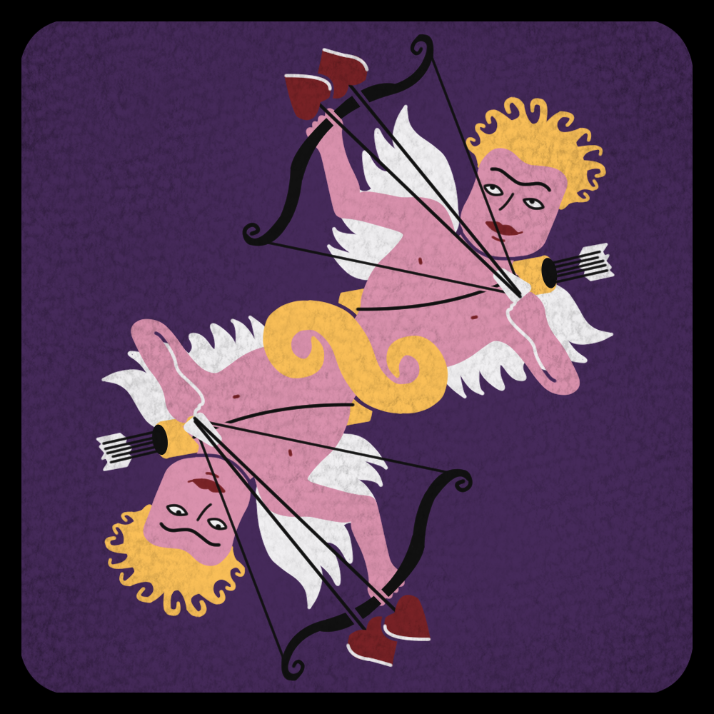

<code>s01</code>

</td>
<td class="role-text-cell" valign="top">

🟪 <code>s01</code> · Cupido Independente

Categoria: Personagens independentes · <a href="#lista-rapida-de-personagens">voltar à lista rápida</a>

<strong>Na primeira noite escolhe dois jogadores que serão Namorados:</strong> Se um Namorado morrer, o outro se suicida.

O objetivo dos Namorados é de serem os últimos sobreviventes.

Duas vezes durante o jogo pode escolher se quer dar imunidade aos Namorados durante aquela noite (👍).

<strong>Se envenenado:</strong> A proteção não funciona.

<strong>Objetivo:</strong> Os Namorados serem os únicos sobreviventes.

</td>
</tr>
<tr class="role-row faction-independent" id="s02">
<td class="role-image-cell" width="150" valign="top" align="center">
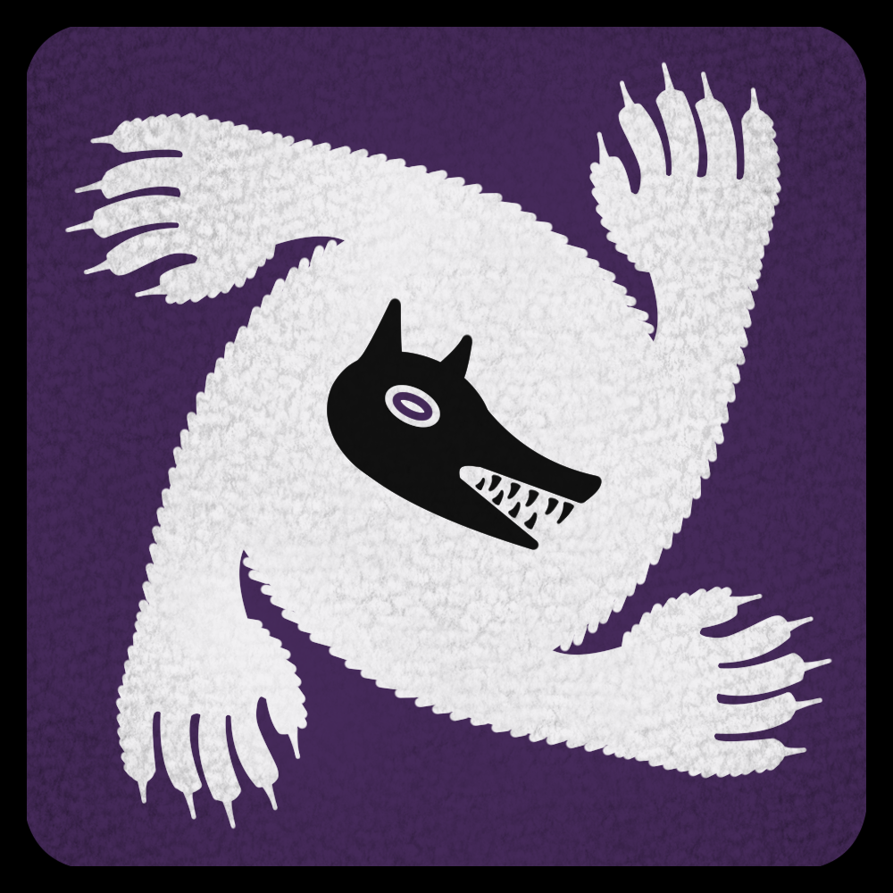

<code>s02</code>

</td>
<td class="role-text-cell" valign="top">

🟪 <code>s02</code> · Lobisomem Branco Independente

Categoria: Personagens independentes · <a href="#lista-rapida-de-personagens">voltar à lista rápida</a>

Acorda e age como um Lobisomem, mas a cada três noites tem também de assassinar um Lobisomem.

Se o Lobisomem Branco for o único Lobisomem vivo, ele continua a ser chamado a cada três noites para assassinar um jogador a mais.

<strong>Se envenenado:</strong> Pode matar um Lobisomem a mais.

<strong>Objetivo:</strong> Ser o último sobrevivente.

</td>
</tr>
</tbody>
</table>
---

### Personagens flexíveis

<table class="character-table">
<colgroup>
<col class="image-col" width="150">
<col>
</colgroup>
<thead>
<tr>
<th width="150">Carta</th>
<th>Descrição</th>
</tr>
</thead>
<tbody>
<tr class="role-row faction-flex" id="f01">
<td class="role-image-cell" width="150" valign="top" align="center">
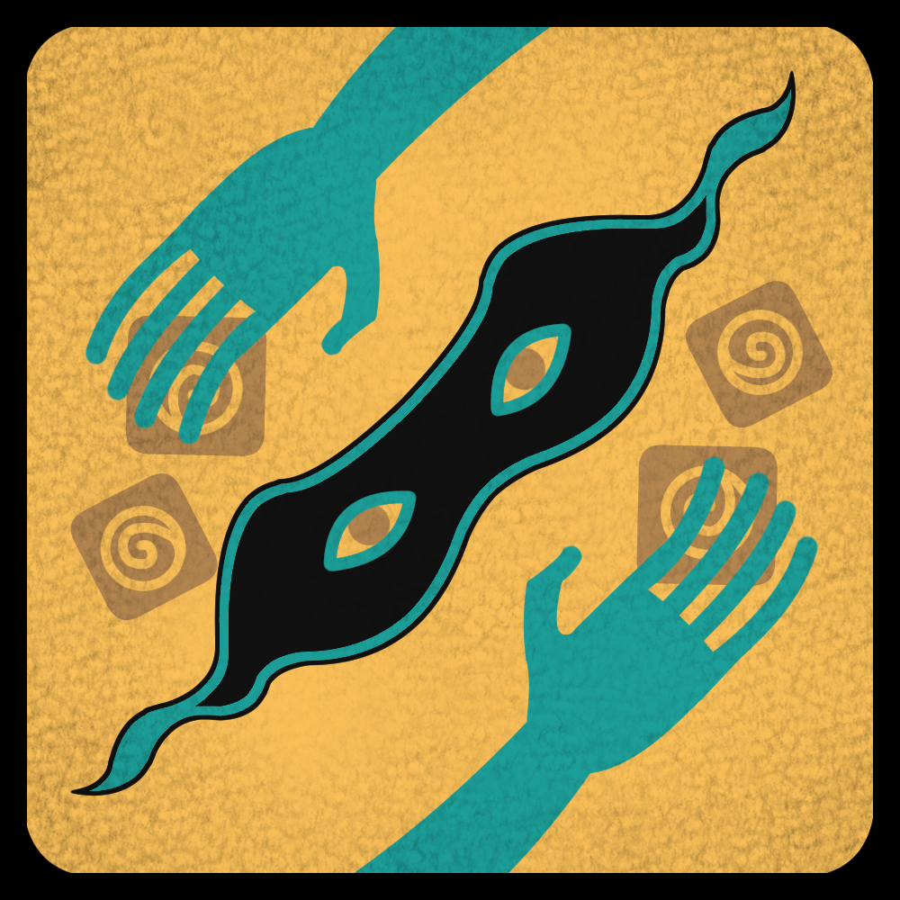

<code>f01</code>

</td>
<td class="role-text-cell" valign="top">

🟨 <code>f01</code> · Ladrão Flexível

Categoria: Personagens flexíveis · <a href="#lista-rapida-de-personagens">voltar à lista rápida</a>

Cada noite, escolhe um jogador que não poderá votar no próximo tribunal.

Na segunda noite deverá escolher se quer jogar do lado dos Aldeões (👍) ou do lado dos Lobisomens (👎).

NÃO ACORDA COM OS LOBISOMENS.

<strong>Se envenenado:</strong> O voto não será retirado.

<strong>Objetivo:</strong> à escolha.

</td>
</tr>
<tr class="role-row faction-flex" id="f02">
<td class="role-image-cell" width="150" valign="top" align="center">
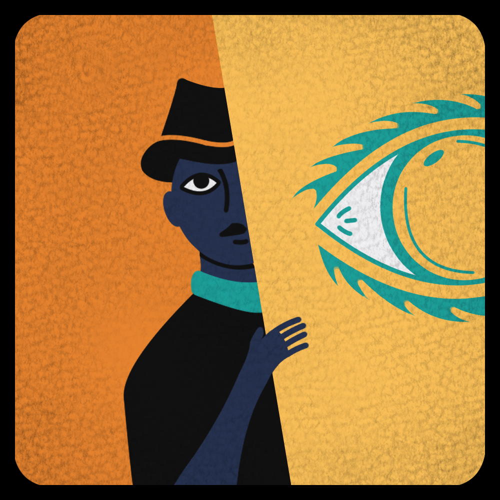

<code>f02</code>

</td>
<td class="role-text-cell" valign="top">

🟨 <code>f02</code> · Espião Flexível

Categoria: Personagens flexíveis · <a href="#lista-rapida-de-personagens">voltar à lista rápida</a>

Cada noite, é chamado e é-lhe mostrada uma carta de um jogador em jogo. Nunca verá a carta de um mesmo jogador duas vezes.

Na segunda noite deverá escolher se quer jogar do lado dos Aldeões (👍) ou do lado dos Lobisomens (👎).

NÃO ACORDA COM OS LOBISOMENS.

<strong>Se envenenado:</strong> Verá uma carta que não está em jogo.

<strong>Objetivo:</strong> à escolha.

</td>
</tr>
</tbody>
</table>
---

### Personagens complexos

<table class="character-table">
<colgroup>
<col class="image-col" width="150">
<col>
</colgroup>
<thead>
<tr>
<th width="150">Carta</th>
<th>Descrição</th>
</tr>
</thead>
<tbody>
<tr class="role-row faction-good" id="a01">
<td class="role-image-cell" width="150" valign="top" align="center">
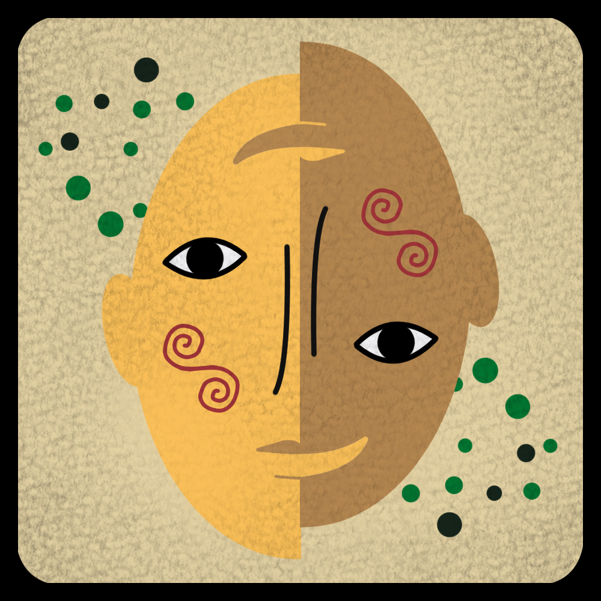

<code>a01</code>

</td>
<td class="role-text-cell" valign="top">

🟩 <code>a01</code> · Bêbado Aldeões

Categoria: Personagens complexos · <a href="#lista-rapida-de-personagens">voltar à lista rápida</a>

Não sabe que é o Bêbado.

Substitui a Vidente, a Menina, o Sonâmbulo, o Domador do Urso, o Domador dos Coelhos, o Domador do Corvo, o Domador da Raposa ou o Domador da Aranha (aleatório a cada jogo).

Mas todas as informações que lhe são dadas são como se o personagem estivesse envenenado.

<strong>Se envenenado:</strong> Recebe as informações certas.

<strong>Objetivo:</strong> Matar todos os Lobisomens.

</td>
</tr>
<tr class="role-row faction-flex" id="a02">
<td class="role-image-cell" width="150" valign="top" align="center">
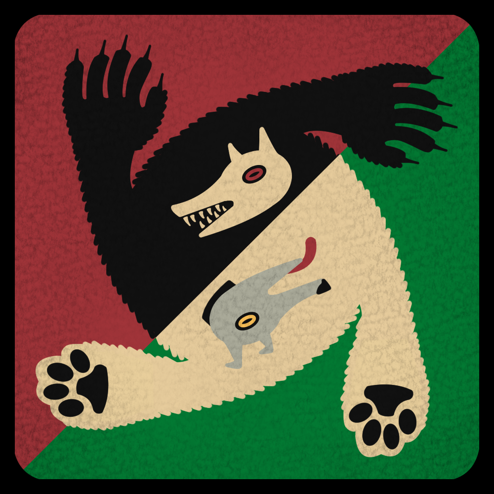

<code>a02</code>

</td>
<td class="role-text-cell" valign="top">

🟨 <code>a02</code> · Cão-Lobo Flexível

Categoria: Personagens complexos · <a href="#lista-rapida-de-personagens">voltar à lista rápida</a>

Na segunda noite pode escolher se quer ser um simples Lobisomem (👎) ou ser um Cão (👍) :

O Cão escolhe um dono e ganha os poderes do dono.

A cada noite o cão acorda com o seu dono e nesse caso, cada um terá direito a fazer a sua ação independentemente.

<strong>Se envenenado:</strong> O mesmo efeito que o dono ou que um Lobisomem.

<strong>Objetivo:</strong> à escolha ou segundo o dono.

</td>
</tr>
<tr class="role-row faction-good" id="a03">
<td class="role-image-cell" width="150" valign="top" align="center">
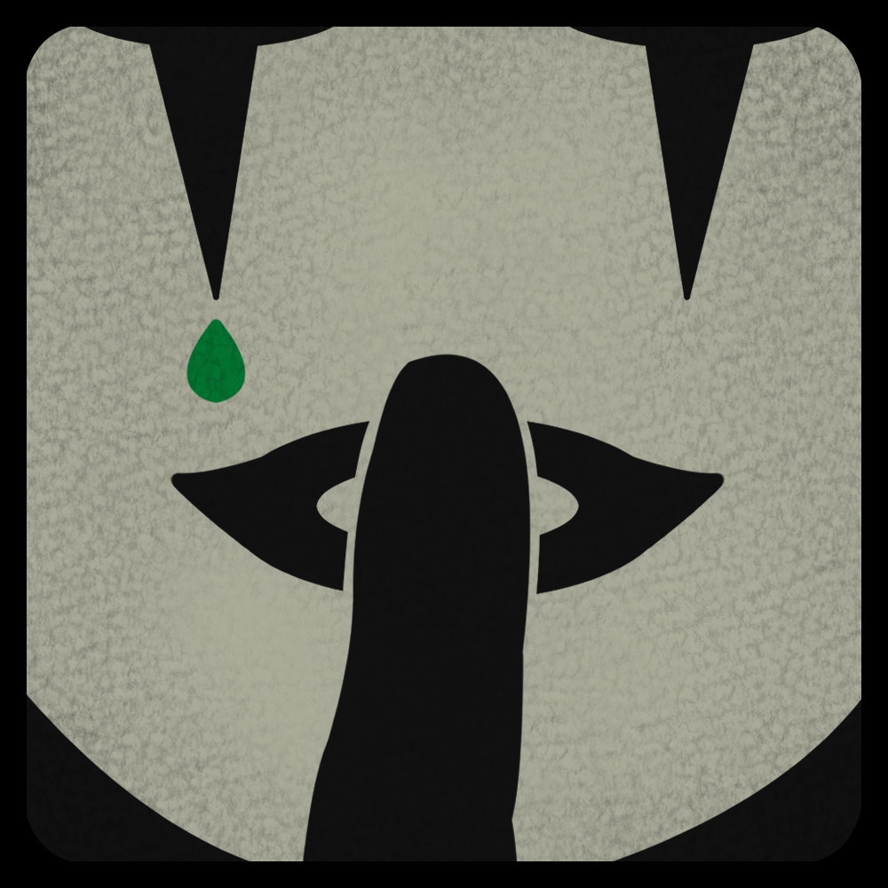

<code>a03</code>

</td>
<td class="role-text-cell" valign="top">

🟩 <code>a03</code> · Mimo Aldeões

Categoria: Personagens complexos · <a href="#lista-rapida-de-personagens">voltar à lista rápida</a>

A cada noite, é chamado e é-lhe mostrada uma carta de um jogador em jogo.

Mal a carta lhe é revelada, o Mimo indica a ação que quer fazer segundo o poder que lhe foi mostrado.

Todas as interações entre o Narrador e o Mimo são silenciosas, independentemente do poder do personagem.

<strong>Se envenenado:</strong> Efeito do personagem que está a substituir.

<strong>Objetivo:</strong> Matar todos os Lobisomens.

</td>
</tr>
<tr class="role-row faction-shifting" id="a04">
<td class="role-image-cell" width="150" valign="top" align="center">
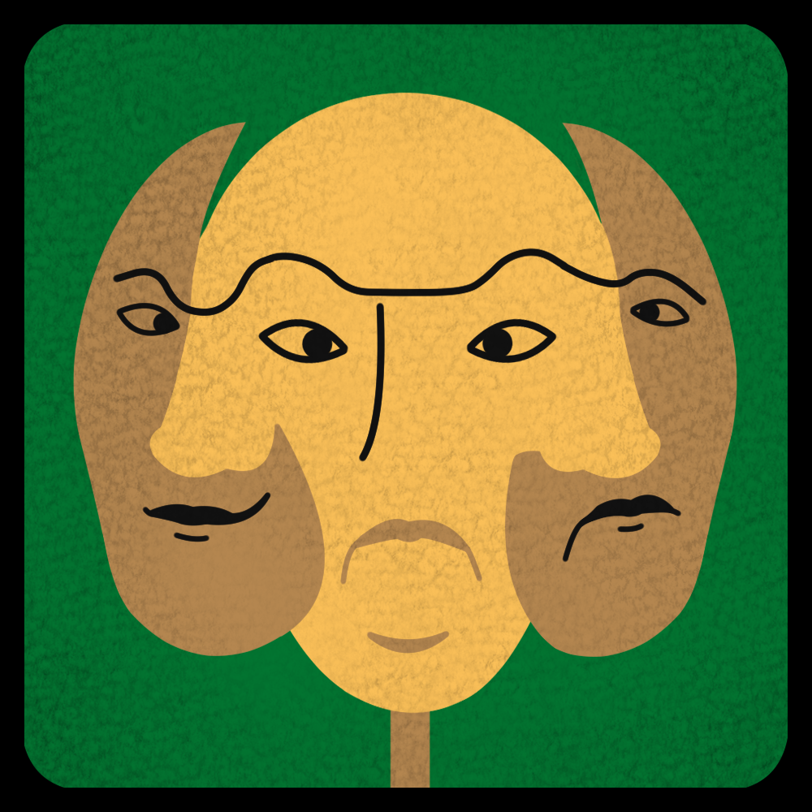

<code>a04</code>

</td>
<td class="role-text-cell" valign="top">

🟩🟨 <code>a04</code> · Ator Aldeões

Categoria: Personagens complexos · <a href="#lista-rapida-de-personagens">voltar à lista rápida</a>

Na primeira noite, escolhe um jogador que será o seu Ídolo e que copiará se esse jogador morrer. O poder só lhe é revelado quando o Ídolo morrer.

Pode trocar de Ídolo duas vezes durante o jogo (👈/👎).

<strong>Se envenenado:</strong> Efeito do personagem que está a substituir.

<strong>Objetivo:</strong> Matar todos os Lobisomens. (flexivel)

</td>
</tr>
<tr class="role-row faction-shifting" id="a05">
<td class="role-image-cell" width="150" valign="top" align="center">
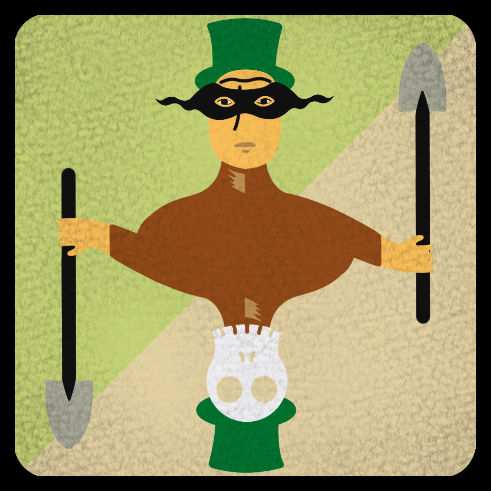

<code>a05</code>

</td>
<td class="role-text-cell" valign="top">

🟩🟨 <code>a05</code> · Rouba-Túmulos Aldeões

Categoria: Personagens complexos · <a href="#lista-rapida-de-personagens">voltar à lista rápida</a>

A cada noite, é-lhe mostrado as vítimas.

Sem saber os seus poderes, o Rouba-Túmulos pode escolher trocar de papel com uma delas (👈/👎).

Uma vez a vítima escolhida, o seu papel lhe será revelado.

O Rouba-Túmulos usa permanentemente esses poderes em vez do seu. A vítima se torna Rouba-Túmulos.

O Rouba-Túmulos será chamado pelo nome do personagem que substituiu desde então.

<strong>Se envenenado:</strong> Não acorda.

<strong>Objetivo:</strong> Matar todos os Lobisomens. (flexivel)

</td>
</tr>
<tr class="role-row faction-evil" id="a06">
<td class="role-image-cell" width="150" valign="top" align="center">
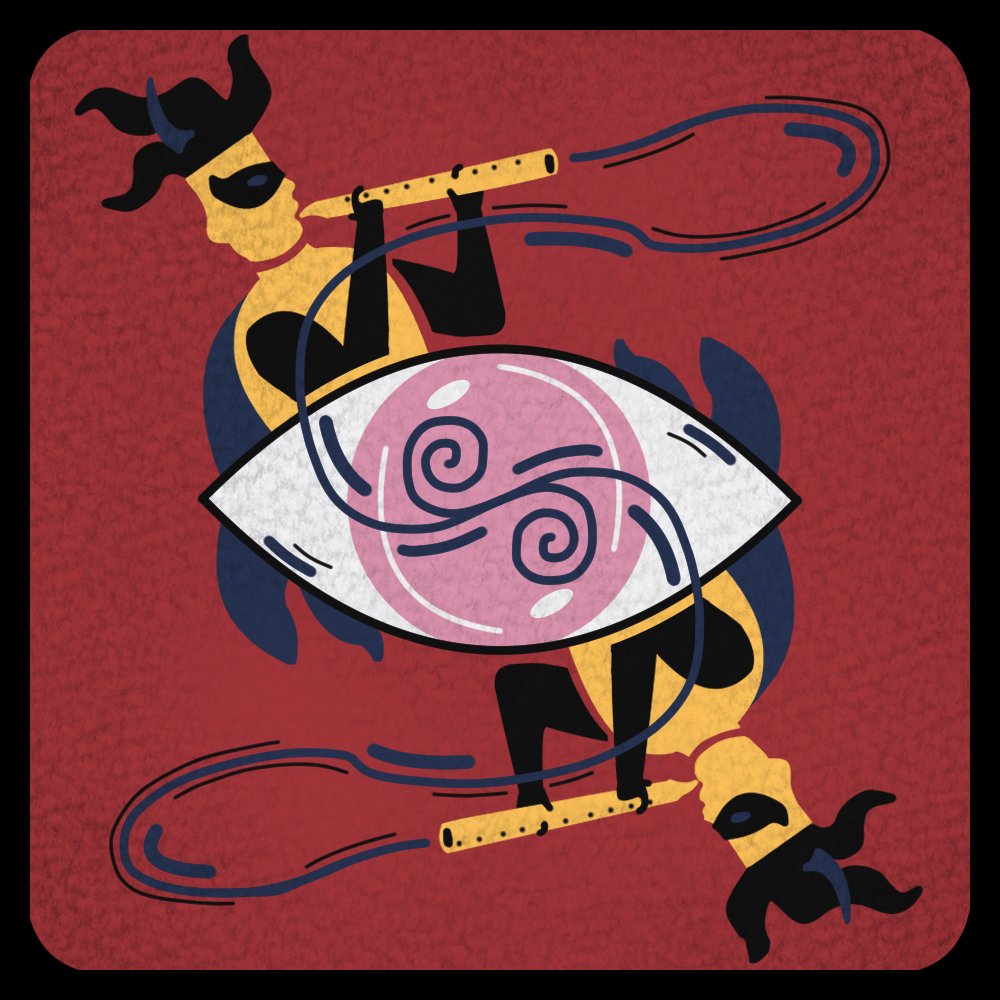

<code>a06</code>

</td>
<td class="role-text-cell" valign="top">

🟥 <code>a06</code> · Ilusionista Criaturas Malvadas

Categoria: Personagens complexos · <a href="#lista-rapida-de-personagens">voltar à lista rápida</a>

NÃO ACORDA COM OS LOBISOMENS.

Cada noite, escolhe um jogador (pode ser a si próprio). Esse jogador estará escondido por uma Ilusão.

Se a Vidente, Lobisomem-Vidente, Domador da Aranha, Faroleiro ou Espião virem uma Ilusão, verão o papel “Ilusionista”.

Se o Mimo copia uma Ilusão, ele copia o Ilusionista.

Se o alvo de um dos Domadores de Animais for uma Ilusão, o animal ficará confuso. No caso do Domador da Aranha, se o jogador com a teia de aranha for uma Ilusão, a aranha estará confusa.

Se o assassino da vítima escolhida pela Menina for uma Ilusão, a Menina verá o papel “Ilusionista”.

Se o jogador acusado pelo Pedro for uma Ilusão, o Pedro recebe como informação que esse jogador não é Lobisomem, mesmo se for.

<strong>Se envenenado:</strong> A ilusão não acontecerá.

<strong>Objetivo:</strong> Matar todos os Aldeões.

</td>
</tr>
<tr class="role-row faction-independent" id="as01b">
<td class="role-image-cell" width="150" valign="top" align="center">
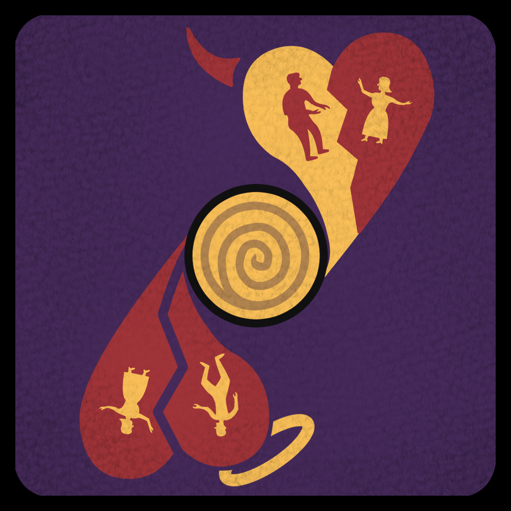

<code>as01b</code>

</td>
<td class="role-text-cell" valign="top">

🟪 <code>as01b</code> · Amante Secreto Independente

Categoria: Personagens complexos · <a href="#lista-rapida-de-personagens">voltar à lista rápida</a>

A cada noite aponta para um jogador e o Narrador informa-lhe se é um dos Namorados (👍) ou não (👎).

Se o jogador for um dos Namorados, este será informado, e o Amante Secreto substituirá o outro Namorado sem que esse o saiba.

Se o Traidor ou o Amante Secreto morrerem, o Traído não morre.

A flecha de proteção do Cupido também protege a identidade dos Namorados (a resposta será 👎).

<strong>Se envenenado:</strong> O Narrador anuncia que um dos Namorados foi traído.

<strong>Objetivo:</strong> O Amante Secreto e o Traidor serem os únicos sobreviventes.

</td>
</tr>
</tbody>
</table>
---

### Personagens forretas (para quando há muita gente)

<table class="character-table">
<colgroup>
<col class="image-col" width="150">
<col>
</colgroup>
<thead>
<tr>
<th width="150">Carta</th>
<th>Descrição</th>
</tr>
</thead>
<tbody>
<tr class="role-row faction-good" id="l01">
<td class="role-image-cell" width="150" valign="top" align="center">
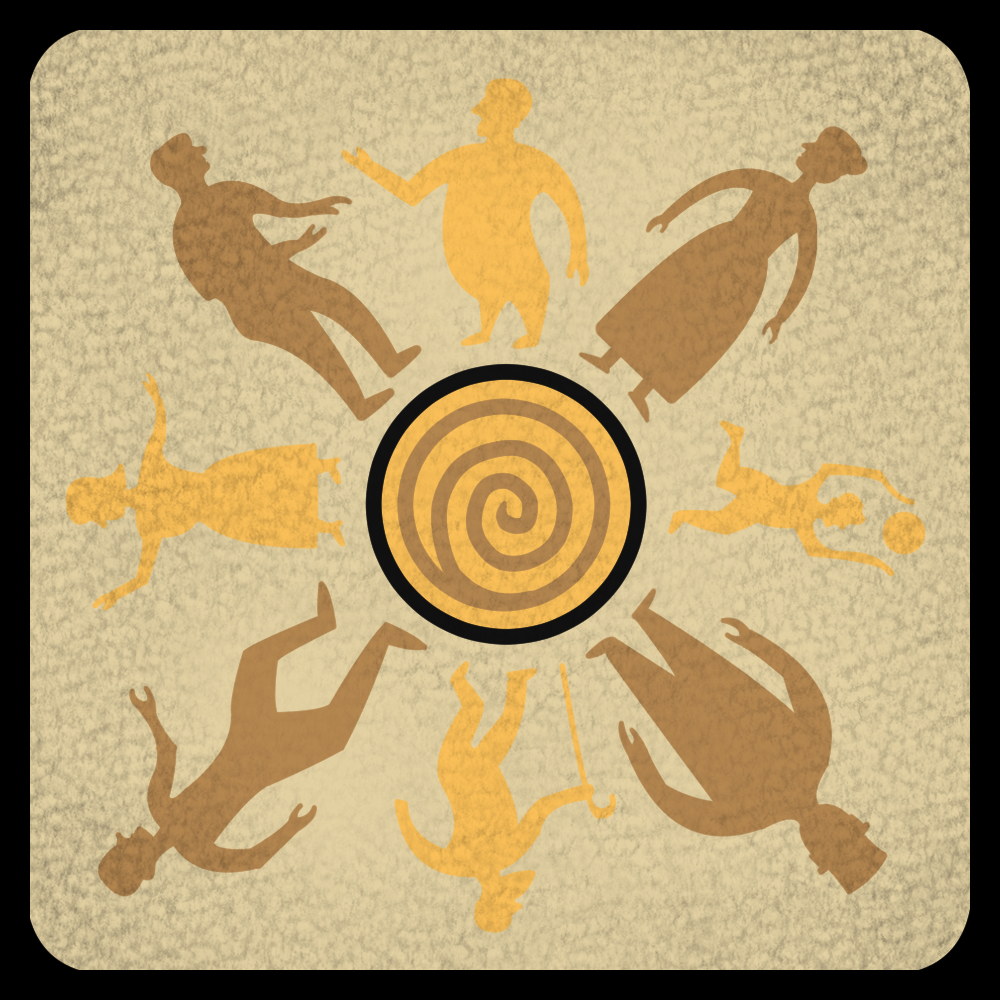

<code>l01</code>

</td>
<td class="role-text-cell" valign="top">

🟩 <code>l01</code> · Aldeão Triste Aldeões

Categoria: Personagens forretas (para quando há muita gente) · <a href="#lista-rapida-de-personagens">voltar à lista rápida</a>

Sem poder especial.

<strong>Objetivo:</strong> Matar todos os Lobisomens.

</td>
</tr>
<tr class="role-row faction-shifting" id="l02">
<td class="role-image-cell" width="150" valign="top" align="center">
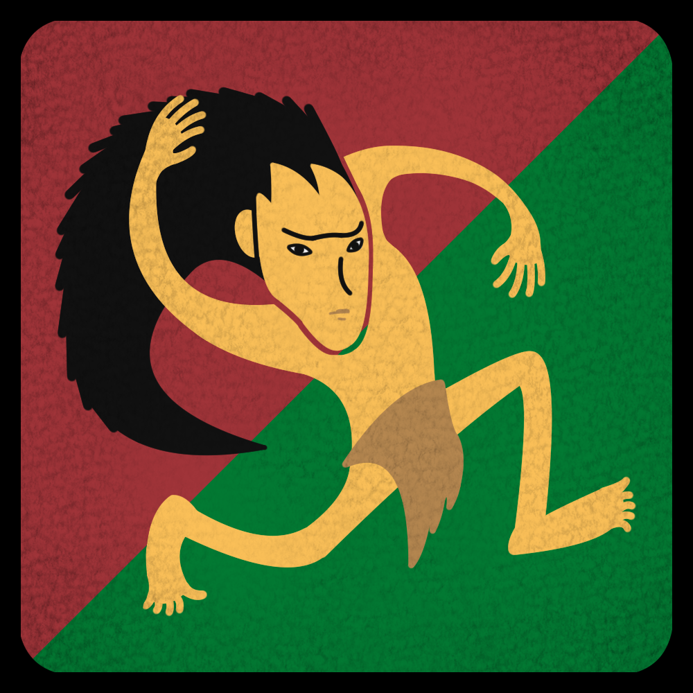

<code>l02</code>

</td>
<td class="role-text-cell" valign="top">

🟩🟨 <code>l02</code> · Criança Selvagem Aldeões

Categoria: Personagens forretas (para quando há muita gente) · <a href="#lista-rapida-de-personagens">voltar à lista rápida</a>

Na segunda noite escolhe um jogador como Pai Adotivo.

Se o Pai Adotivo morrer, a Criança Selvagem, se transforma em Lobisomem.

<strong>Se envenenado:</strong> Transforma-se em Lobisomem.

<strong>Objetivo:</strong> Matar todos os Lobisomens. (flexível)

</td>
</tr>
<tr class="role-row faction-shifting" id="l03">
<td class="role-image-cell" width="150" valign="top" align="center">
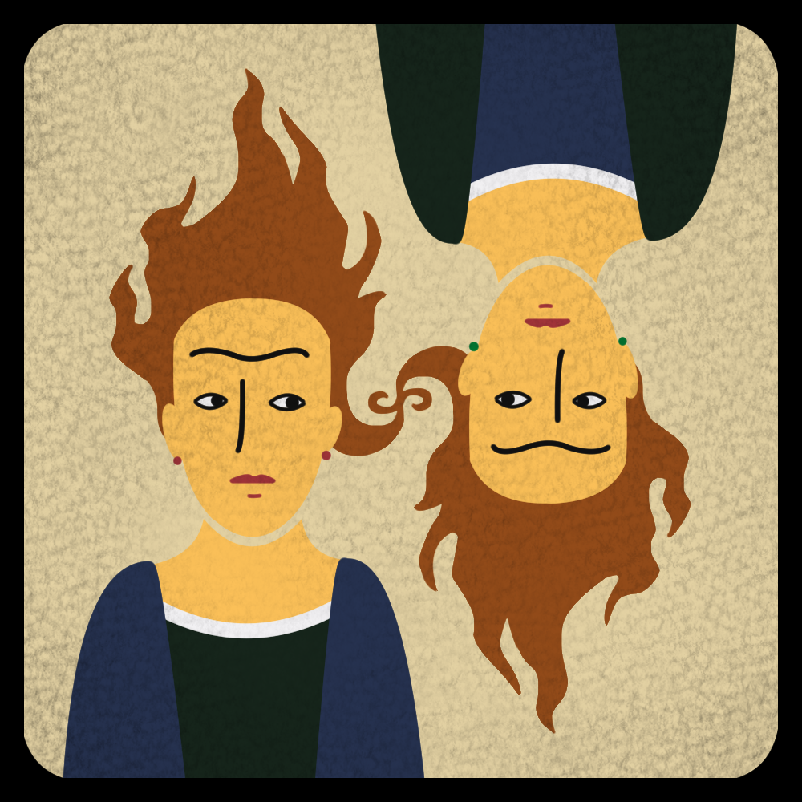

<code>l03</code>

</td>
<td class="role-text-cell" valign="top">

🟩🟨 <code>l03</code> · Irmãs Aldeões

Categoria: Personagens forretas (para quando há muita gente) · <a href="#lista-rapida-de-personagens">voltar à lista rápida</a>

As Irmãs conhecem-se.

Se uma irmã for executada, a outra pode escolher se vingar, tornando-se uma Criatura Malvada.

Ela acorda SÓ UMA VEZ com os Lobisomens na próxima noite, para que eles saibam que ela os vai ajudar durante o dia.

<strong>Se envenenada enquanto Criatura Malvada:</strong> Se torna num Lobisomem.

<strong>Objetivo:</strong> Matar todos os Lobisomens. (flexível)

</td>
</tr>
<tr class="role-row faction-good" id="l04">
<td class="role-image-cell" width="150" valign="top" align="center">
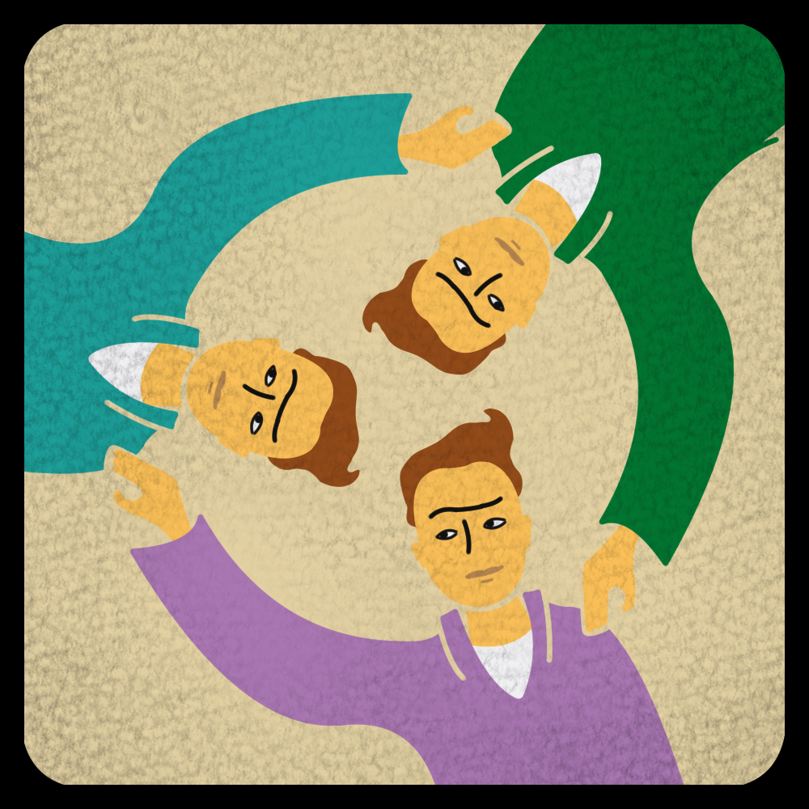

<code>l04</code>

</td>
<td class="role-text-cell" valign="top">

🟩 <code>l04</code> · Irmãos Aldeões

Categoria: Personagens forretas (para quando há muita gente) · <a href="#lista-rapida-de-personagens">voltar à lista rápida</a>

Os Irmãos conhecem-se.

Enquanto pelo menos dois irmãos sobreviverem à noite, nenhum morre.

<strong>Se qualquer um estiver envenenado:</strong> Morre na mesma.

<strong>Objetivo:</strong> Matar todos os Lobisomens.

</td>
</tr>
</tbody>
</table>
---

### Extras

<table class="character-table">
<colgroup>
<col class="image-col" width="150">
<col>
</colgroup>
<thead>
<tr>
<th width="150">Carta</th>
<th>Descrição</th>
</tr>
</thead>
<tbody>
<tr class="role-row faction-extra" id="x01">
<td class="role-image-cell" width="150" valign="top" align="center">
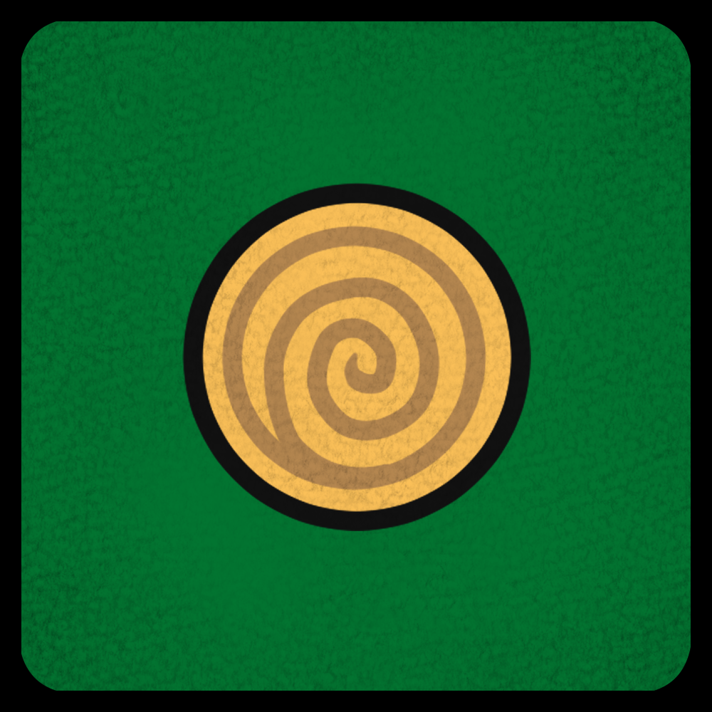

<code>x01</code>

</td>
<td class="role-text-cell" valign="top">

⬜ <code>x01</code> · Aldeões Extra

Categoria: Extras · <a href="#lista-rapida-de-personagens">voltar à lista rápida</a>

Assustados e desconfiados, os Aldeões mentem, tentam encontrar em quem podem confiar e usam os seus poderes para matar e executar todos os Lobisomens e outras Criaturas Malvadas antes que esses consigam apoderar-se da Aldeia.

<strong>Objetivo:</strong> Matar todos os Lobisomens.

</td>
</tr>
<tr class="role-row faction-extra" id="x02">
<td class="role-image-cell" width="150" valign="top" align="center">

<code>x02</code>

</td>
<td class="role-text-cell" valign="top">

⬜ <code>x02</code> · Criaturas Malvadas Extra

Categoria: Extras · <a href="#lista-rapida-de-personagens">voltar à lista rápida</a>

Inclui todos os inimigos dos Aldeões, esses sendo Lobisomens ou outros personagens malvados.

O objetivo de todas as Criaturas Malvadas é o mesmo: matar todos os Aldeões, antes destes conseguirem encontrar todos os Lobisomens.

<strong>Objetivo:</strong> Matar todos os Aldeões.

</td>
</tr>
<tr class="role-row faction-extra" id="x02.1">
<td class="role-image-cell" width="150" valign="top" align="center">

<code>x02.1</code>

</td>
<td class="role-text-cell" valign="top">

⬜ <code>x02.1</code> · Lobisomens Extra

Categoria: Extras · <a href="#lista-rapida-de-personagens">voltar à lista rápida</a>

É o grupo que mais aterroriza os Aldeões.

Cada noite têm que escolher em unanimidade quem querem assassinar, tentando eliminar os Aldeões mais poderosos primeiro, com a ajuda das outras Criaturas Malvadas.

<strong>Se qualquer Lobisomem estiver envenenado:</strong> Não podem matar.

<strong>Objetivo:</strong> Matar todos os Aldeões.

</td>
</tr>
<tr class="role-row faction-extra" id="x03">
<td class="role-image-cell" width="150" valign="top" align="center">

<code>x03</code>

</td>
<td class="role-text-cell" valign="top">

⬜ <code>x03</code> · Fantasma Extra

Categoria: Extras · <a href="#lista-rapida-de-personagens">voltar à lista rápida</a>

Há dois tipos de morte: EXECUÇÃO (condenados pela aldeia) ou ASSASSINATO (mortos pelo poder de um personagem).

Quando um jogador é morto durante a noite, só morre mesmo de manhã, ao acordar, assim durante aquela noite podem continuar a usar os seus poderes.

Os jogadores mortos transformam-se em fantasmas, que podem continuar a comunicar com a aldeia durante o dia, mas não podem falar ou votar no tribunal, e perdem qualquer poder que tinham (a não ser que esteja escrito o contrário na ficha de personagem.)

<strong>Objetivo:</strong> Fantasmas guardam o mesmo objetivo que enquanto vivos.

Os Fantasmas TAMBÉM DORMEM À NOITE.

</td>
</tr>
<tr class="role-row faction-extra" id="x.v09">
<td class="role-image-cell" width="150" valign="top" align="center">
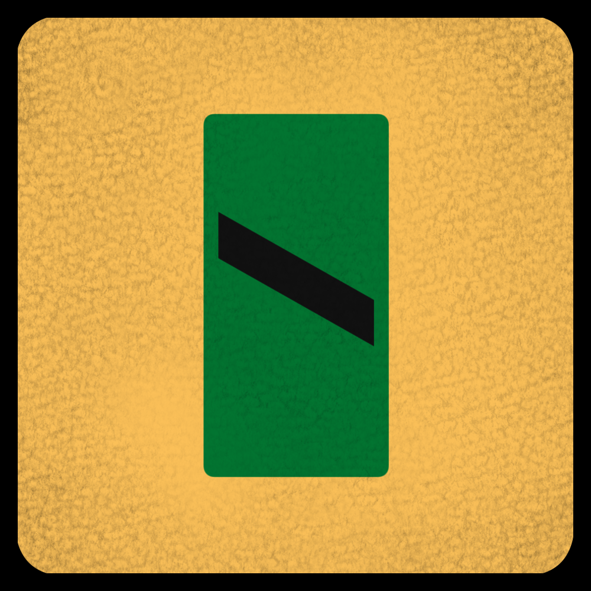

<code>x.v09</code>

</td>
<td class="role-text-cell" valign="top">

⬜ <code>x.v09</code> · Soldado Extra

Categoria: Extras · <a href="#lista-rapida-de-personagens">voltar à lista rápida</a>

Criado pelo Capitão.

Uma vez morto, será acordado na próxima noite para escolher um jogador que deverá assassinar.

<strong>Se envenenado:</strong> Sem efeito.

<strong>Objetivo:</strong> Não muda.

</td>
</tr>
<tr class="role-row faction-extra" id="x.s01">
<td class="role-image-cell" width="150" valign="top" align="center">

<code>x.s01</code>

</td>
<td class="role-text-cell" valign="top">

⬜ <code>x.s01</code> · Namorado Extra

Categoria: Extras · <a href="#lista-rapida-de-personagens">voltar à lista rápida</a>

Conhece a identidade do outro Namorado.

Se um morrer, o outro suicida-se.

Se a vítima for imune ou for salva, ninguém morre.

Se o suicida for imune ou salvo, ele não morre.

<strong>Objetivo:</strong> Os Namorados serem os únicos sobreviventes.

</td>
</tr>
<tr class="role-row faction-extra" id="x.as01b.1">
<td class="role-image-cell" width="150" valign="top" align="center">
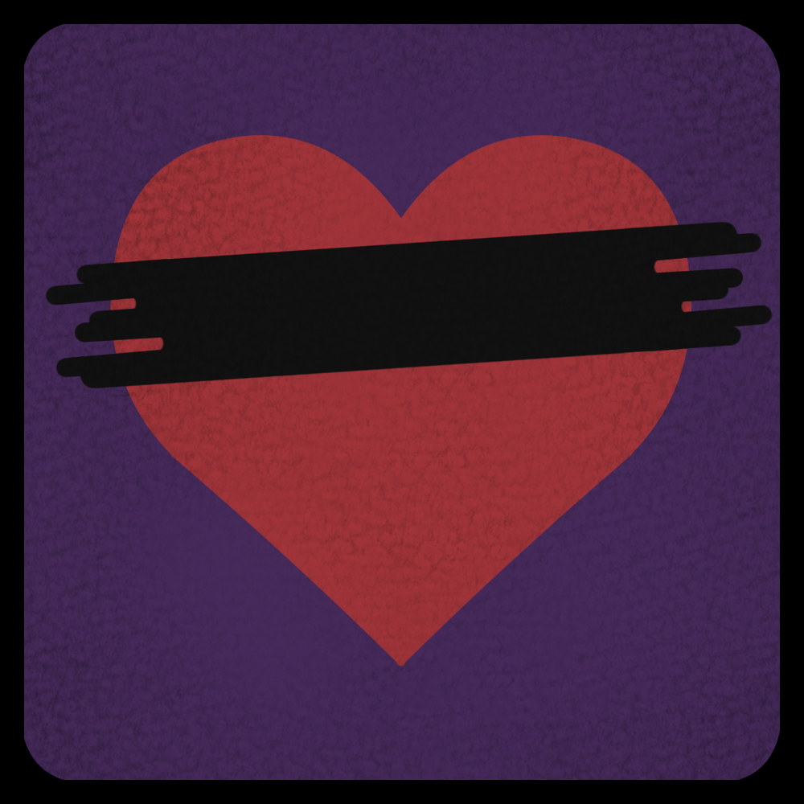

<code>x.as01b.1</code>

</td>
<td class="role-text-cell" valign="top">

⬜ <code>x.as01b.1</code> · Traidor Extra

Categoria: Extras · <a href="#lista-rapida-de-personagens">voltar à lista rápida</a>

Conhece a identidade do Amante Secreto.

Se um morrer, o outro suicida-se.

Se a vítima for imune ou for salva, ninguém morre.

Se o suicida for imune ou salvo, ele não morre.

<strong>Objetivo:</strong> O Amante Secreto e o Traidor serem os únicos sobreviventes.

</td>
</tr>
<tr class="role-row faction-extra" id="x.as01b.2">
<td class="role-image-cell" width="150" valign="top" align="center">

<code>x.as01b.2</code>

</td>
<td class="role-text-cell" valign="top">

⬜ <code>x.as01b.2</code> · Traído Extra

Categoria: Extras · <a href="#lista-rapida-de-personagens">voltar à lista rápida</a>

Não sabe que é o Traído, continua a agir como um Namorado até o descobrir.

Se o Traidor ou o Amante Secreto morrerem, o Traído não morre.

<strong>Objetivo:</strong> O do papel original.

</td>
</tr>
<tr class="role-row faction-extra" id="x.m05">
<td class="role-image-cell" width="150" valign="top" align="center">

<code>x.m05</code>

</td>
<td class="role-text-cell" valign="top">

⬜ <code>x.m05</code> · Inimigo Extra

Categoria: Extras · <a href="#lista-rapida-de-personagens">voltar à lista rápida</a>

Se um Inimigo conseguir condenar o outro a execução, o primeiro recebe imunidade contra a próxima tentativa de assassinato.

A cada vez que um dos Inimigos morre, o Cupido Malvado é acordado para escolher um novo Inimigo para o sobrevivente.

<strong>Objetivo:</strong> Não muda.

</td>
</tr>
</tbody>
</table>

---

## A Noite

### Primeira Noite
> [!NOTE]
> Esta noite não terá mortos.
> Lançar um d12.

- O Cupido acorda e escolhe dois jogadores que serão Namorados. O Cupido adormece e os Namorados serão agora tocados e podem se conhecer. Se um Namorado morre, o outro se suicida. O objetivo dos Namorados e do Cupido é que os Namorados sejam os últimos sobreviventes. Enquanto os Namorados estiverem vivos, o jogo continua.
- O Cupido Malvado acorda e escolhe dois jogadores que serão Inimigos. O Cupido Malvado adormece e os Inimigos serão tocados e podem se conhecer. Se um Inimigo consegue condenar o outro a execução, o primeiro recebe imunidade na próxima tentativa de assassinato.
- As Irmãs acordam para se conhecerem.
- Os Irmãos acordam para se conhecerem.
- O Ator acorda e escolhe um Ídolo cujo poder copiará quando o Ídolo morrer. Só lhe será revelado o poder do Ídolo, na noite a seguir à morte do Ídolo.
- O Domador da Aranha acorda e escolhe um jogador no qual tece uma teia de aranhã. O Domador da Aranha, a cada noite, descobre quais personagens apontaram para esse jogador naquela noite.
- O Domador do Corvo acorda e é-lhe revelado o número de Criaturas Malvadas que vivem na Aldeia.
- O Domador da Raposa acorda e indica três vizinhos. Será-lhe revelado, com o polegar, se um desses três jogadores é uma Criatura Malvada.
- O Urso rosna/não rosna.
- O Chefe da Aldeia acorda e escolhe um jogador que automaticamente terá 2 votos contra ele no próximo Tribunal.
- No fim desta noite ouve-se um uivar. A Aldeia sabe então que os Lobisomens se revelaram e estão com fome. A Aldeia acorda desconfiada de toda a gente.

### Início da Segunda Noite
- O Ladrão acorda e escolhe com o polegar se quer jogar do lado dos Aldeões ou do lado dos Lobisomens.
- O Cão-Lobo acorda e diz com o polegar se quer ser um Cão ou um Lobisomem. Se escolher ser um Cão vai indicar um dono, que vai ser tocado e que poderá acordar para conhecer o seu cachorro. É revelado ao Cão o papel do seu dono. A partir deste momento, o Cão acorda sempre com o seu dono e deve também usar o seu poder independentemente do dono. Se escolher ser um Lobisomem, pode voltar a dormir.
- A Criança Selvagem acorda e escolhe o seu Pai Adotivo. Se este morrer durante o jogo, a Criança Selvagem se tornará um Lobisomem.
- Os Lobisomens acordam e são-lhe apresentados as Criaturas Malvadas.

### Noite Normal
> [!NOTE]
> Lançar um d12.
> Ressuscitar o jogador salvo pelo Anjo, se aplicável.

> Se o Cavaleiro Enferrujado morreu durante o dia, matar o Lobisomem mais próximo durante o próximo dia.

- (Se o jogador com a teia morreu) O Domador da Aranha acorda e escolhe um novo jogador no qual tece uma teia.
- (Se o Capuchinho Vermelho foi executado) O Caçador acorda furioso e escolhe quem quer assassinar.
- (Se o Caçador morreu) O Fantasma do Caçador acorda e escolhe quem quer assassinar.
- (Se o SOLDADO morreu) O Fantasma do Soldado acorda e escolhe quem quer assassinar.
- O Ator acorda. Se o seu Ídolo morreu, é-lhe mostrado o papel ao qual irá responder de agora em diante, senão o Ator indica ao apontar outra pessoa se quer trocar de Ídolo.
- (Se um Inimigo morrer) O Cupido Malvado acorda e escolhe um segundo Inimigo. O Cupido Malvado adormece e os Inimigos serão tocados e podem se conhecer. Se um Inimigo consegue condenar o outro a execução, o primeiro recebe imunidade na próxima tentativa de assassinato.
- O Sonâmbulo acorda e escolhe um jogador para visitar, uma vez a escolha feita, adormece na casa dessa pessoa. Essa pessoa vai ser tocada e sabe que mesmo se for chamada, não acordará.
- A Bruxa Malvada acorda e escolhe um jogador que irá envenenar esta noite.
- A Empregada acorda e é-lhe revelada a distância até a pessoa envenenada.
- A Cigana acorda e indica 3 vizinhos. Se um deles estiver envenenado, ele perde o veneno e a Cigana passa a estar envenenada.
- O Ilusionista acorda e indica o jogador cuja a identidade será obstruída.
- (Se alguém morreu) A Vidente acorda e é-lhe revelado o papel dos mortos de ontem. (Limpar “† de ontem”).
- O Espião acorda e é-lhe revelado um papel em jogo.
- O Domador do Corvo acorda e é-lhe revelado o número de Criaturas Malvadas que ainda vivem na Aldeia (ou o Corvo está confuso).
- O Domador da Raposa acorda e indica três vizinhos. Será-lhe revelado, com o polegar, se um desses três jogadores é uma Criatura Malvada (ou se a Raposa está confusa).
- O Urso rosna/não rosna (/está confuso).
- O Chefe da Aldeia acorda e escolhe um jogador que automaticamente terá 2 votos contra ele no próximo Tribunal.
- O Ladrão acorda e indica a quem quer retirar o voto no próximo Tribunal.
- O Capitão acorda e escolhe um jogador que será um SOLDADO durante esta noite e o próximo dia.
- O Cupido acorda e decide com o polegar se quer usar uma das suas duas flechas de proteção para dar imunidade aos Namorados esta noite.
- O Amante Secreto acorda e aponta para um jogador, e será revelado se é um dos Namorados. Se for o caso, esse Namorado será tocado e pode acordar para lhe ser revelado o seu Amante, que substitui o antigo Namorado.
- O Salvador acorda e indica quem será imune durante esta noite e o dia.
- O Piromaníaco acorda/não acorda. São-lhe mostradas as pessoas inocentadas no último tribunal. Ele decide, ao indicar ou mostrar o polegar para baixo, se quer ou não incendiar a casa de uma delas.
- O Pedro acorda (todas as noites). Se ele acusou alguém em Tribunal, é-lhe indicado se essas pessoas são Lobisomens. Relembro que o Pedro não pode levar a mesma pessoa a Tribunal duas vezes.
- Os Lobisomens acordam/não acordam se envenenados e escolhem em conjunto uma vítima que irão assassinar esta noite.
- O Lobisomem Mau acorda e escolhe com o polegar se quer se mascarar de Avózinha esta noite e dia, ou não. Pode usar esse poder duas vezes durante todo o jogo.
- O Lobisomem Vidente acorda/não acorda se envenenados e decide com o polegar se quer salvar a vítima para ver o seu papel ou deixá-la morrer.
- O Lobisomem Vampiro acorda/não acorda se salvo pela Vidente ou se envenenados e diz com o polegar se quer transformar a vítima em Lobisomem. Se for o caso, a vítima será tocada, e passará a acordar sempre com os Lobisomens. A vítima diz com o polegar se quer guardar os seus poderes ou não.
- (A cada 3 noites) O Lobisomem Branco acorda e escolhe o Lobisomem que quer matar. / O Lobisomem Branco acorda e escolhe mais um jogador que quer matar.
- O Domador dos Coelhos ouviu os Coelhos assustados esta noite/ [nada] (/os Coelhos estão confusos)
- O Chaman acorda/não acorda se não houver vítimas e são-lhe apresentadas as vítimas. Ele escolhe então com o polegar se as quer salvar ou não. Relembro que pode salvar duas pessoas durante o jogo todo.
- O Faroleiro acorda e é-lhe mostrado um personagem em jogo com um poder limitado e é informado de quantos usos esse personagem ainda tem.
- O Mimo acorda e é-lhe mostrado um papel em jogo. Ele age silenciosamente segundo esse papel ou recebe as informações que esse papel receberia.
- (Se o Cavaleiro Enferrujado morreu durante a noite, matar o Lobisomem mais próximo.)
- O Rouba-Túmulos acorda/não acorda se não houver vítimas e lhe são apresentadas as vítimas. Ele decide, ao indicar ou mostrar com o polegar para baixo, se quer ou não tomar o lugar de uma delas. Se escolher substituir uma das vítimas, o Rouba-Túmulos troca de poder com esse fantasma.
- A Menina acorda/não acorda se não houver vítimas e vê como as vítimas desta noite morreram.
- O Profeta acorda/não acorda se não houver vítimas e indica, ao apontar um jogador que acha que morreu esta noite. Se estiver correto, o jogador será tocado, para saber que pode guardar o seu poder, mesmo como Fantasma, durante o próximo dia e a noite.
- O Domador da Aranha acorda/não acorda se não houver necessidade e é-lhe mostrado todas os papeis dos jogadores que foram apanhados pela teia esta noite.

---

## Código para o guião interativo
- <https://wotct.lovable.app>

---